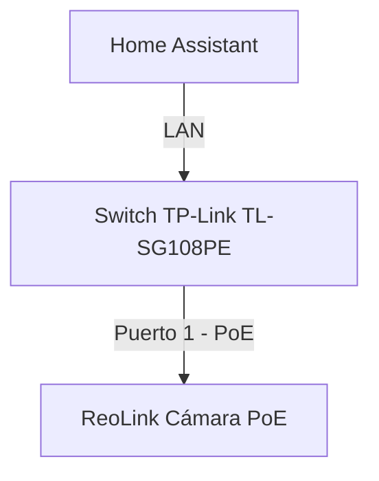

{: width="150px" style="float:left; padding-right:25px" }

Este documento describe cómo controlar un puerto PoE en un switch TP-Link desde la red local. Este switch no soporta `SNMP` por lo que voy a usar `curl` para autenticarme y activar o desactivar un puerto específico. El caso de uso es poder encender/apagar una cámara PoE ReoLink conectada a uno de los puertos e integrarlo con Home Assistant.

<br clear="left"/>
<!--more-->

## Introducción

El switch es un `TPLink TL-SG108PE` y lo tengo configurado con el nombre de host `sw-despacho-mesa.parchis.org`. Para poder "atacarlo" vía `curl` primero hay que autenticarse y después pedir acciones como encender, apagar o consultar el estado de un puerto. Este equipo utiliza autenticación basada en **Sesión del Servidor** (en vez de basada en basada en Cookies). Al autenticarse con el primer `curl`, el servidor vincula la dirección IP del cliente o algún identificador único (como un token) a una sesión activa y si las solicitudes posteriores provienen del mismo cliente en un tiempo razonable, el servidor las considera parte de la misma sesión, razón por la que el segundo comando `curl` funciona.

| Nota: si el switch usase sesiones basadas en Cookies el truco consiste en salvar salvar la cookie (opcion `-c`) en la primera ejecución de `curl` y en la segunda enviarla con la opción `-b`. |



**Autenticación**: Este es el comando que autentica al cliente (ordenador desde donde se ejecuta) en el switch. Es necesario ejecutarlo antes de intentar controlar o consultar los puertos, ya que las solicitudes de control requieren una sesión autenticada. Si ya se encuentra autenticado, este comando puede ejecutarse de nuevo sin problemas.

```bash
curl -X POST "http://sw-despacho-mesa.parchis.org/logon.cgi" \
-H "Content-Type: application/x-www-form-urlencoded" \
--data-urlencode "username=<usuario>" \
--data-urlencode "password=<contraseña>" \
--data-urlencode "cpassword=" \
--data-urlencode "logon=Login"
```

**Encender/Apagar el Puerto PoE**: Al activar/desactivar el puerto (PoE), la cámara se encenderá o apagará al recibir o dejar de recibir energía. Estos son los dos comandos, la clave está en el valor de `state`. El primero activa el puerto y el segundo lo desactiva.

```bash
curl --basic --request GET "http://sw-despacho-mesa.parchis.org/port_setting.cgi?portid=1&state=1&speed=1&flowcontrol=0&apply=Apply"

curl --basic --request GET "http://sw-despacho-mesa.parchis.org/port_setting.cgi?portid=1&state=01&speed=1&flowcontrol=0&apply=Apply"
```

**Obtener el estado de un puerto**: Es posible interrogar al Switch para ver el estado de un puerto concreto. En el siguiente ejemplo averiguo el estado de los puertos y muestro el valor del primero (`1=encendido` y `0=apagado`)

```bash
curl -s --basic --request GET "http://sw-despacho-mesa.parchis.org/port_setting.cgi" | grep -oP 'state:\[\K[^\]]+' | awk -F, '{print $1}'
```

## Integración con HA

En el fichero `/homeassistant/configuration.yaml` incluyo lo siguiente:

```yaml
command_line: !include command_line.yaml
```

Esta es la copia del fichero `command_line.yaml`

```yaml
# command_line.yaml
# Para ejecutar comandos externos

# Creo un objeto switch para poder conmutar ON/OFF el puerto del switch
#
- switch:
    name: ReoLink Despacho Sensor
    command_on: >
      curl -X POST "http://sw-despacho-mesa.parchis.org/logon.cgi" -H "Content-Type: application/x-www-form-urlencoded" --data-urlencode "username=luis" --data-urlencode "password=<CONTRASEÑA>" --data-urlencode "logon=Login" &&
      sleep 1 &&
      curl --basic --request GET "http://sw-despacho-mesa.parchis.org/port_setting.cgi?portid=1&state=1&speed=1&flowcontrol=0&apply=Apply" &&
      sleep 5
    command_off: >
      curl -X POST "http://sw-despacho-mesa.parchis.org/logon.cgi" -H "Content-Type: application/x-www-form-urlencoded" --data-urlencode "username=luis" --data-urlencode "password=<CONTRASEÑA>" --data-urlencode "logon=Login" &&
      sleep 1 &&
      curl --basic --request GET "http://sw-despacho-mesa.parchis.org/port_setting.cgi?portid=1&state=0&speed=1&flowcontrol=0&apply=Apply" &&
      sleep 5
    command_state: >
      ping -c 1 -W 2 camara-despacho.parchis.org | grep "1 packets received" | wc -l
    value_template: '{{ value == "1" }}'

# Creo un objeto binary_sensor para conocer es estado de la cámara
#
- binary_sensor:
    name: ReoLink Despacho Conectividad
    command: 'ping -c 1 -W 2 camara-despacho.parchis.org | grep "1 packets received" | wc -l'
    device_class: connectivity
    payload_on: 1
    payload_off: 0

```
