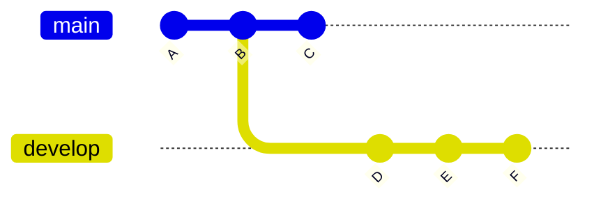
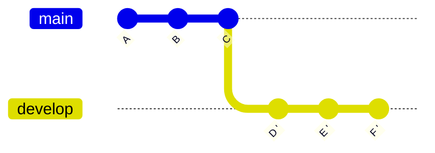
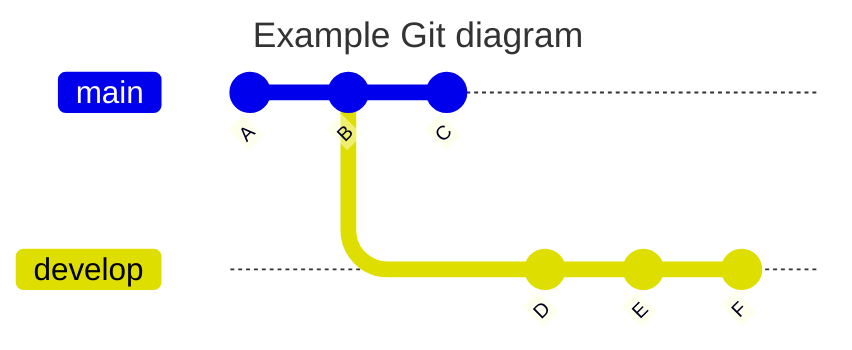
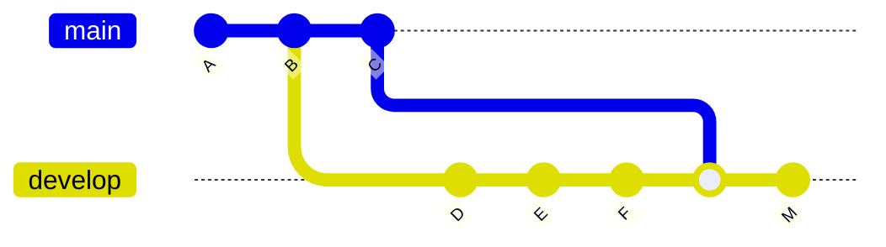

This post contains **my GIT cheat sheet**, various reminders I use as a programmer — common commands or situations. It comes in handy for example when I accidentally delete a file and want to recover it, check a previous version of code, or ignore a modification in a specific file.

<br clear="left"/>
<!--more-->



I recommend using this content as a *reference*, assuming you already know Git. If you want to truly dive deep into Git, I recommend this tutorial, a [detailed post about GIT]()



---

## Basics

Setting up the environment and other basic commands

```zsh
git config --global user.name "Don Quijote"
git config --global user.email "donquijote@email.com"

mkdir -p /home/proyectos/miproyecto
cd /home/proyectos/miproyecto
git init

cd /home/proyectos
git clone https://github.com/LuisPalacios/LuisPalacios.github.io

cd /home/proyectos/miproyecto
git status
```

---

### Tags

Some examples about using Tags

```zsh
$ git log --pretty=oneline
a7a05..d9114 (HEAD -> master, origin/master, origin/HEAD) Nueva versión
:
3f64b..37101 Versión terminada
ce5d4..1e621 Primer commit
$ git tag 1.0 3f64b           <== Applied to the commit with hash 3f64b
$ git tag -d 1.0              <== Delete it to re-add with annotation
$ git tag -a 1.0 -m "Primera versión operativa" 3f64b
$ git tag 2.0                 <== Applies to the latest commit
$ git push origin 1.0         <== Push tag or tags to origin.
$ git push origin --tags
```

---

### Aliases

Examples of aliases I've tried. I normally only configure the first two; in fact the one I use most is `git adog` which is easy to remember.

```zsh
git config --global alias.adog "log --all --decorate --oneline --graph"
git config --global alias.slog "log --graph --all --topo-order --pretty='format:%h %ai %s%d (%an)'"
git config --global alias.lo '!git --no-pager log --graph --decorate --pretty=oneline --abbrev-commit'
git config --global alias.lg '!git lg1'
git config --global alias.lg1 '!git lg1-specific --all'
git config --global alias.lg1-specific "log --graph --abbrev-commit --decorate --format=format:'%C(bold blue)%h%C(reset) - %C(bold green)(%ar)%C(reset) %s - %an %C(blue)%d%C(reset)'"
```

```zsh
git adog
git lg
```

---

### Checkout a specific commit

From time to time I need to go to a specific commit, check or test something, and then go back to where I was, at the top of my branch. Let's say I'm on `main`, I want to go to a specific commit, compile, test, and verify something, and then return to where I was (the latest commit on main):

```zsh
# 1) I go back in time...
git checkout <short-hash>

# 2) I work on the commit, check whatever I need...

# 3) I go back to the tip of my branch
git checkout main
# note: equivalent command, which is now recommended...
git switch main
```

---

### Undo

Technically this means *reverting a file in the working copy to its previous version*. Very useful when we've deleted or modified a file by mistake and want to completely undo and go back to its previous version (from the last commit). Be careful as this is destructive — it restores the previous file content and whatever we modified is lost...

```zsh
git restore Capstone/dataset/0.dataclean/datos.ipynb
```

---

### Git Rebase vs Merge

When you're working on your branch, where you're implementing a feature, it's very common that meanwhile the `main` branch may have moved forward with new changes, and the time comes when you want to sync up. The two most common ways are using *rebase* or *merge*.

#### REBASE

**Rebase from the CLI**: In the following diagram you can see a summary.

Let's assume I create a branch `git checkout -b develop` while on commit `B`, meanwhile `main` continues evolving and has a new commit (`C`).



I was on my `develop` branch, and made my own commits (`D, E, F`). When I want to "catch up", I can update my local references of all remote branches and do a `rebase` from the latest state of `origin/main`. It rewrites the history, takes my commits, "detaches" them, and reapplies them (on my branch) after where `origin/main` is, so `D', E', F'` are **rewritten new versions** applied after `C`, as if the branch had started at that point.



**Can you predict a potential conflict?** The answer is no, because of how `git rebase` works — it applies commits one by one — the conflict can arise on any of those commits, and you won't know until Git tries to apply it.

What I do is assess the probability of conflict. I run a merge in dry-run mode, and if it's not going to cause problems, I proceed with the rebase. If it complains, then it's very likely the rebase will also complain, and in that case I prefer to do a MERGE, going to the next option described below.

```bash
# I fetch the latest changes from Origin without applying anything
git fetch origin
# I check the probability of conflict
git merge --no-commit --no-ff origin/main
<... here it will tell you if it went well or not ...>
git merge --abort

# If everything went well, then I do the rebase
git rebase origin/main
git push --force-with-lease
```

**What if there are conflicts?**:

No worries, Git will give very useful messages. It tells you exactly which files have conflicts and gives you the options to resolve them. The key is that the rebase stops at each commit that causes a conflict. The process is: resolve the conflict, continue the rebase, repeat the process if there are more conflicts in other commits until you're done.

- Identify the files with conflicts
- From VSCode for example, edit the file with the conflict. Keep the version you consider correct and remove the rest.

```cpp
<<<<< HEAD
// Your code, what you did in your branch
=======
// The code from the 'origin/main' branch
>>>>> addff7d5...
```

- Save the file.
- Mark it as resolved > `git add fichero.txt` (you do this by adding it to the stage)
- Repeat with the rest of the files
- Continue with the rebase `git rebase --continue`
- Repeat with all commits that have conflicts...
- Once you're done, **forced** push with `push --force-with-lease`

---

**Rebase from GitKraken**: Same example but from this application

- I'm usually the only one working on this branch
  - In GitKraken:
    - In the sidebar or the commit graph, find the develop branch
    - Right click > **Checkout this branch**
- I enter the cycle of modifying, making commits, and pushing
  - Changes in the IDE
  - In GitKraken:
    - **"Commit Panel"** tab (usually bottom left)
    - Select modified files
    - Add a message
    - Click on **"Stage all changes"**
    - Then on **"Commit changes"**
    - Then press **"Push"** in the top bar
  - Repeat as I progress.
- I update local references of all remote branches (origin)
  - In GitKraken:
    - **"Fetch"** button at the top.
    - This updates all origin/* references (including origin/main).
    - It doesn't change your current branch or any local branch.
- I rebase my branch onto the latest state of origin/main
  - In GitKraken:
    - Make sure I'm on the branch (**checkout**) develop.
    - In the commit graph **locate origin/main**
    - **Right click origin/main** > **"Rebase develop onto origin/main"**
- Since I had already pushed this branch before, I now need a force push
  - In GitKraken:
    - After the rebase, the **"Push"** button shows a warning icon (unclean push).
    - Click on the dropdown arrow of **Push** and choose **"Force Push (with lease)"**
    - If there are conflicts, GitKraken will visually indicate them and let you resolve them one by one in the side panel.

---

#### MERGE

**Merge from the CLI**: In the following diagram you can see a summary.

Let's assume I create a branch `git checkout -b develop` while on commit `B`, meanwhile `main` continues evolving and has a new commit (`C`).



I enter the cycle of modifying my branch, making commits (`D, E, F`) and pushing. When I want to "catch up", I update local references of all remote branches and merge what comes from main into my branch, creating a new commit.



If there are conflicts I resolve them, otherwise I push this new commit to sync my remote branch.

```bash
git fetch origin
git merge origin/main
git push
```

---

## GitHub CLI (`gh`)

95% of the time I use the `git` command for everything related to Git, but we work a lot with GitHub, and if you do too, I recommend installing [GitHub CLI](https://cli.github.com/) — it's a great tool:

```shell
brew install gh  (MacOS)
apt install gh   (Ubuntu)
```

It always works while **authenticated with a specific user** and performs all operations using a **Personal Access Token**. If you have more than one account (personal and work) you'll need to switch between them depending on which repository you're in.

### Configuring `ssh`

It's essential to have SSH well configured, whether you have a single Personal account or multiple ones. I recommend the post [Git multi-account]() if you have multiple accounts — having your SSH configuration perfectly operational is essential for `gh` to behave as expected.

### Configuring `gh` Personal account

This is the most common case: you only work with one user and all you need to do is register your PAT (Personal Access Token) and renew it when it expires.

- [Login to GitHub](https://github.com/login) with my PERSONAL account (`LuisPalacios`)
- [Generate New Token (Classic)](https://github.com/settings/tokens) from Settings/Developer Settings.
  - The token needs 'repo', 'read:org', 'admin:public_key' permissions.

<div class="image-box">
  
  <div class="image-caption">My PAT permissions</div>
</div>

<div class="image-box">
  
  <div class="image-caption">Remember to copy the Token (PAT)</div>
</div>

- `gh auth status` I check the status (I should not be authenticated with any user)

```zsh
🍏 luis@asterix:~ % gh auth status
You are not logged into any GitHub hosts. To log in, run: gh auth login
```

- `gh auth login` with my personal account, using SSH and the PAT token from the previous step

<div class="image-box">
  
  <div class="image-caption">gh auth login with personal account, SSH and PAT</div>
</div>

Done! If you only have a single GitHub account, you're finished and can work with `gh`, for example to [import an existing local repository into GitHub](#github-import-local-repository).

### Configuring `gh` Professional account

This is also a common case among developers. You have a couple of accounts, a personal one for your repos and another that you use working for Organizations (companies). I recommend this post about [gh working with multiple accounts](https://github.com/cli/cli/blob/54d56cab3a0882b43ac794df59924dc3f93bb75c/docs/multiple-accounts.md). Support for this mode was added from v2.40.0. And as I mentioned before, I recommend having SSH well configured in this kind of multi-account environment — check out the post [Git multi-account]().

Again, I need to register my PAT (Personal Access Token) for my professional account and renew it when it expires. I create it and save it.

- [Login to GitHub](https://github.com/login) with my PROFESSIONAL account (`EMPRESA-Luis-Palacios`)
- [Generate New Token (Classic)](https://github.com/settings/tokens) from Settings/Developer Settings.
  - The token needs 'repo', 'read:org', 'admin:public_key' permissions.

I verify that I indeed only have one account registered and authenticated — the one I configured in the previous step.

```zsh
🍏 luis@asterix:~ % gh auth switch
✓ Switched active account for github.com to LuisPalacios
🍏 luis@asterix:~ % gh auth status
github.com
  ✓ Logged in to github.com account LuisPalacios (keyring)
  - Active account: true
  - Git operations protocol: ssh
  - Token: ghp_************************************
  - Token scopes: 'admin:public_key', 'read:org', 'repo'
```

- `gh auth login` with my Professional account, using SSH and the PAT token from the previous step

```zsh
🍏 luis@asterix:~ % gh auth login
? What account do you want to log into? GitHub.com
? What is your preferred protocol for Git operations on this host? SSH
? Upload your SSH public key to your GitHub account? /Users/luis/.ssh/id_ed25519_git_EMPRESA-luis-palacios.pub
? Title for your SSH key: Clave SSH EMPRESA-Luis-Palacios para GitHub CLI
? How would you like to authenticate GitHub CLI? Paste an authentication token
? Paste your authentication token: ****************************************
- gh config set -h github.com git_protocol ssh
✓ Configured git protocol
✓ SSH key already existed on your GitHub account: /Users/luis/.ssh/id_ed25519_git_EMPRESA-luis-palacios.pub
✓ Logged in as EMPRESA-Luis-Palacios
```

- We can now check which account we're on and switch between them

```zsh
🍏 luis@asterix:~ % gh auth status
github.com
  ✓ Logged in to github.com account EMPRESA-Luis-Palacios (keyring)
  - Active account: true
  - Git operations protocol: ssh
  - Token: ghp_************************************
  - Token scopes: 'admin:public_key', 'read:org', 'repo'

  ✓ Logged in to github.com account LuisPalacios (keyring)
  - Active account: false
  - Git operations protocol: ssh
  - Token: ghp_************************************
  - Token scopes: 'admin:public_key', 'read:org', 'repo'

🍏 luis@asterix:~ % gh auth switch
✓ Switched active account for github.com to LuisPalacios
🍏 luis@asterix:~ % gh auth switch
✓ Switched active account for github.com to EMPRESA-Luis-Palacios
🍏 luis@asterix:~ % gh auth switch
✓ Switched active account for github.com to LuisPalacios

```

## GitHub import local repository

If we already have a local repository, initialized with GIT, and want to create the same on GitHub, we just need to follow the [official documentation](https://docs.github.com/en/migrations/importing-source-code/using-the-command-line-to-import-source-code/adding-locally-hosted-code-to-github). There are basically two ways to do it:

- "[Adding a local repository to GitHub with GitHub CLI](https://docs.github.com/en/migrations/importing-source-code/using-the-command-line-to-import-source-code/adding-locally-hosted-code-to-github#adding-a-local-repository-to-github-with-github-cli)" - You can do everything from your computer, after installing the `gh` command
- "[Adding a local repository to GitHub using Git](https://docs.github.com/en/migrations/importing-source-code/using-the-command-line-to-import-source-code/adding-locally-hosted-code-to-github#adding-a-local-repository-to-github-using-git)" - You need to work on your computer and on GitHub.

In this post I describe the first one, with GitHub CLI, which is the most convenient. You need to install `gh` as shown above, [Set up GitHub CLI](#github-cli-gh), and have it properly configured for your account (or accounts) on GitHub.

- I create a directory for my project, or access a directory that has a project I want to import

```shell
mkdir -p /Users/luis/00.git/02.github-luispa/zsh-zshrc
cd /Users/luis/00.git/02.github-luispa/zsh-zshrc
e README.md
e zsh-zshrc.sh
```

- I enter the directory and initialize Git with `git init`

```shell
cd /Users/luis/00.git/02.github-luispa/zsh-zshrc
git init
git branch -M main           # Rename from master to main, it's the standard on GitHub
```

- We add to the staging area and make the commits we need...

```shell
cd /Users/luis/00.git/02.github-luispa/zsh-zshrc
e LICENSE  # I can keep editing/adding etc...
git add .
git config user.name "Luis Palacios"
git config user.email "micorreopersonal@personal.com"
git commit -m "first commit"
```

- We're ready to upload it. I use `gh` to "push" my local repository to GitHub, in a single command.

```shell
cd /Users/luis/00.git/02.github-luispa/zsh-zshrc
gh repo create --description "Mi .zshrc" --remote=origin --source=. --public --push
✓ Created repository LuisPalacios/zsh-zshrc on GitHub
✓ Added remote git@github.com:LuisPalacios/zsh-zshrc.git
```

If the remote is different (for example in the case of multiple users) I change it

```zsh
git remote set-url origin gh-LuisPalacios:LuisPalacios/zsh-zshrc.git
```

---

## GitHub and web-based Visual Studio Code

If you want to work with [VSCode from your browser](https://docs.github.com/en/codespaces/the-githubdev-web-based-editor), directly connected to any repository hosted on GitHub, you just need to replace `.com` with `.dev`. If the repository is yours (you've logged into GitHub) then you'll have edit permissions and can make commits directly. A couple of examples:

- [https://github.dev/CiscoDevNet/netprog_basics](https://github.dev/CiscoDevNet/netprog_basics)
- [https://github.dev/LuisPalacios/LuisPalacios.github.io/tree/gh-pages](https://github.dev/LuisPalacios/LuisPalacios.github.io/tree/gh-pages)

---

## Squash commits in ORIGIN/main

This is DANGEROUS, DISCOURAGED, and only recommended IF YOU KNOW EXACTLY WHAT YOU'RE DOING. In fact, I only advise it on your own repos where you're not collaborating, to clean them up (from many commits). Sometimes it can be useful.

The use case is when I have a single `main` branch on GitHub and I'm the only developer. I've made many, many commits with small modifications, poorly documented, and I want to "clean up" because my `main` branch is quite messy.

- As an example, I'll take my `main` branch from a project called `refrescar`. My original situation is that my repo has 48 commits and I want to `squash` the last 45 commits (merge the last 45 commits into one).

- The interesting thing is that those commits are already in ORIGIN (i.e., on GitHub).

- The first step is to clone or make sure my local copy is up to date, completely synced, and most importantly that NOBODY ELSE (no other developer is pushing to origin/main).

```zsh
🍏 luis@asterix:refrescar (main) % git pull
🍏 luis@asterix:refrescar (main) % git rev-parse --short HEAD
28f5b2d
🍏 luis@asterix:refrescar (main) % git ls-remote --quiet | grep HEAD | cut -c 1-7
28f5b2d

These are the hashes of the 48 commits...

28f5b2d  oop                 48  <== latest commit
:
483583a  update gitignore    4
86dc978  update readme       3
ddea7e7  Update README.md    2
326d415  Initial commit      1st commit
```

- I set up the editor that `git` uses. We'll need it next, during the `rebase` operation.

  `git config --global core.editor code`

- IMPORTANT. Once you start the `rebase`, if you see problems, abort with: `git rebase --abort`

- Let the fun begin, I do a `rebase` of the last 45 commits

```zsh
🍏 luis@asterix:refrescar (main) % git rebase -i origin/main~45 main
```

- The editor will open automatically and show all commits, from the third #86dc978 (48-45=3) to the last #28f5b2d.

```txt
pick   86dc978 update readme     <== 3rd commit (48-45)     \
squash 483583a update gitignore                             |
:                                                            > Merge
squash fe1dd07 oop                                          |
squash 28f5b2d oop               <== LAST COMMIT            /
````

- In the editor, all commits appear with the word `pick`. Now I need to decide, among these options:
  - pick: Keeps the commit as-is.
  - reword: Lets you change the commit message.
  - edit: Lets you edit the commit content.
  - squash: Combines this commit with the previous one, keeping both commit messages.
  - fixup: Similar to squash, but only keeps the previous commit's message.
  - drop: Removes the commit from the list.

- I leave the first line (3rd historical commit) with `pick 86dc978` and change all other *pick's* to `squash`. I save the file and exit the editor. It automatically attempts to do what we asked, but in my case it detects a conflict (this is normal and good to see how to resolve it):

```zsh
🍏 luis@asterix:refrescar (main) % git rebase -i origin/main~45 main
Auto-fusionando 29-oop-rpg/src/programa.cpp
CONFLICTO (contenido): Conflicto de fusión en 29-oop-rpg/src/programa.cpp
error: no se pudo aplicar 357d14f... oop
hint: Resolve all conflicts manually, mark them as resolved with
hint: "git add/rm <conflicted_files>", then run "git rebase --continue".
hint: You can instead skip this commit: run "git rebase --skip".
hint: To abort and get back to the state before "git rebase", run "git rebase --abort".
hint: Disable this message with "git config advice.mergeConflict false"
No se pudo aplicar 357d14f... oop
```

- I edit the file with the conflict, resolve the conflicts, and save it.

```zsh
🍏 luis@asterix:refrescarA ● ●(main) rebase-i +?) % e 29-oop-rpg/src/programa.cpp
```

- I mark them as resolved by adding them and continue with the rebase

```zsh
🍏 luis@asterix:refrescarA ● ●(main) rebase-i +?) % git add .
🍏 luis@asterix:refrescarA ● ●(main) rebase-i +?) % git rebase --continue
```

- It could happen again that there are conflicts, repeat the steps...

```zsh
🍏 luis@asterix:refrescar (main) % e file-with-conflict...
🍏 luis@asterix:refrescar (main) % git add .
🍏 luis@asterix:refrescar (main) % git rebase --continue

The editor will keep showing and this process may take a while, depending on how many conflicts you have...

```

- At some point you'll stop having conflicts, you'll see the message `Successfully rebased and updated refs/heads/main.`

```zsh
Rebase aplicado satisfactoriamente y actualizado refs/heads/main.
🍏 luis@asterix:refrescar (● main ↕) % git status
En la rama main
Tu rama y 'origin/main' han divergido,
y tienen 1 y 46 commits diferentes cada una respectivamente.
  (use "git pull" if you want to integrate the remote branch with yours)

nada para hacer commit, el árbol de trabajo está limpio
```

- Now we reach the critical point. We'll push to ORIGIN/main our copy doing a FORCE PUSH

```zsh
🍏 luis@asterix:refrescar (● main ↕) % git push origin +main
Enumerando objetos: 117, listo.
Contando objetos: 100% (117/117), listo.
Compresión delta usando hasta 12 hilos
Comprimiendo objetos: 100% (105/105), listo.
Escribiendo objetos: 100% (114/114), 30.13 KiB | 10.04 MiB/s, listo.
Total 114 (delta 19), reused 82 (delta 8), pack-reused 0 (from 0)
remote: Resolving deltas: 100% (19/19), completed with 1 local object.
To github.com-LuisPalacios:LuisPalacios/refrescar.git
 + 5a42ca6...96b4c8d main -> main (forced update)
```

- I show the commit log

```zsh
🍏 luis@asterix:refrescar (main) % git log --all --decorate --oneline --graph
* 96b4c8d (HEAD -> main, origin/main, origin/HEAD) Commit agregado de 45 commits final
* ddea7e7 Update README.md
* 326d415 Initial commit
```

- The repo now has only 3 commits!

<div class="image-box">
  
  <div class="image-caption">Final repository</div>
</div>

- The remaining commits are:

```zsh
96b4c8d  Commit agregado de 45 commits     3rd  <== COMMIT that aggregates everything
ddea7e7  Update README.md                  2nd
326d415  Initial commit                    1st commit
```

---

||
|-|
| Note: **WARNING!!!! It's very important that other developers delete their local copy or reset their current clone** |
||

If another developer does a push (--force) from an old local branch, all the commits will reappear. The recommendation is to do one of the following options:

1. Delete the local repository and clone again

2. Reset the local repository and pull. Below I show an example, I had the OLD repository copied in "refrescar.old"

```zsh
🍏 luis@asterix:refrescar.old (● main ↕) % git reset --hard origin/main
HEAD está ahora en 96b4c8d Commit agregado de 45 commits final
🍏 luis@asterix:refrescar.old (main) % git clean -xdf
🍏 luis@asterix:refrescar.old (main) % git pull
Ya está actualizado.

🍏 luis@asterix:refrescar.old (main) % git log --all --decorate --oneline --graph
* 96b4c8d (HEAD -> main, origin/main, origin/HEAD) Commit agregado de 45 commits final
* ddea7e7 Update README.md
* 326d415 Initial commit
```

---

## Change commit author

This is DANGEROUS, DISCOURAGED, and only recommended IF YOU KNOW EXACTLY WHAT YOU'RE DOING. The use case is when we're certain that the author's name (and/or email) on commits is incorrect.

We'll use the `git filter-branch` command which rewrites the repository history, so you must be careful and back up the repository before making these changes.

### Review commits

To find out the email used for a specific commit:

```zsh
git show -s --format='%ae' <short commit HASH>
```

To review who made the commits:

```zsh
git log --pretty=format:"%h %ce %ae"| grep -i <name or email>
```

### Rename commit author/email

Navigate to your repository and make sure it's up to date

```zsh
cd /ruta/al/repositorio/mirepo
git pull
```

I recommend making a backup

```zsh
cp -r /ruta/al/repositorio/mirepo /ruta/al/respaldo/mirepo.bak
```

Use `git filter-branch` to change the author name + email on all commits:

```zsh
git filter-branch --env-filter '
OLD_EMAIL="email_incorrecto@ejemplo.com"
CORRECT_NAME="Nombre Correcto"
CORRECT_EMAIL="email_correcto@ejemplo.com"

if [ "$GIT_COMMITTER_EMAIL" = "$OLD_EMAIL" ]
then
    export GIT_COMMITTER_NAME="$CORRECT_NAME"
    export GIT_COMMITTER_EMAIL="$CORRECT_EMAIL"
fi
if [ "$GIT_AUTHOR_EMAIL" = "$OLD_EMAIL" ]
then
    export GIT_AUTHOR_NAME="$CORRECT_NAME"
    export GIT_AUTHOR_EMAIL="$CORRECT_EMAIL"
fi
' --tag-name-filter cat -- --branches --tags
```

The command above creates a backup under `.git/refs/original/*`. It's a very good idea to have it in case you did something wrong. I recommend inspecting that everything went well with the following command:

```zsh
git log
```

Once reviewed, push the changes to the remote repository

```zsh
git push --force --tags origin 'refs/heads/*'
```

When you're done and sure everything is fine, you can delete the reference backup (in my case, in this example the branch name is `main`)

```zsh
git update-ref -d refs/original/refs/heads/main
```
