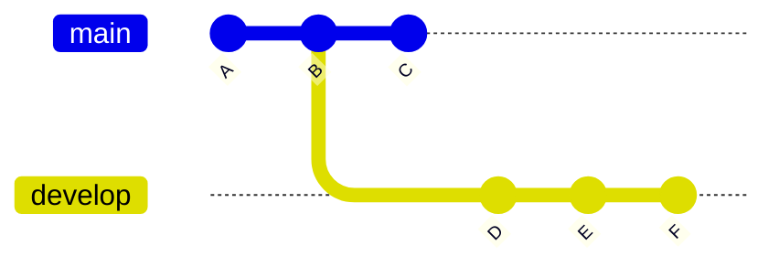
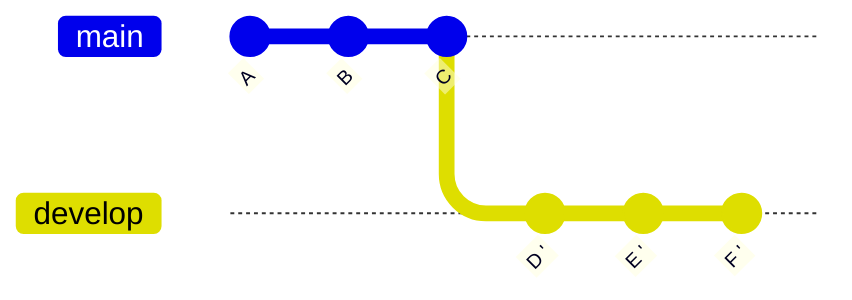
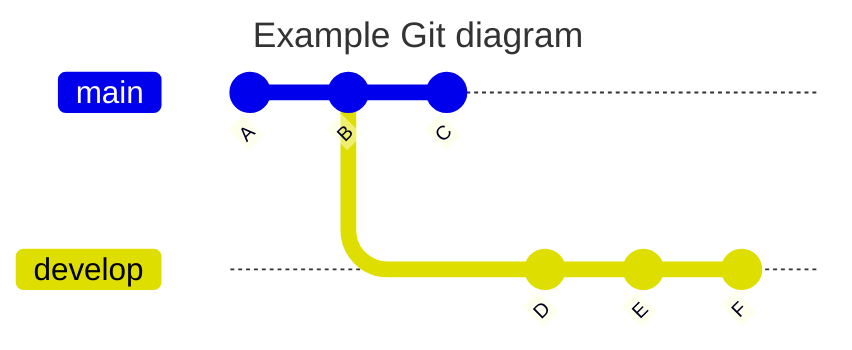
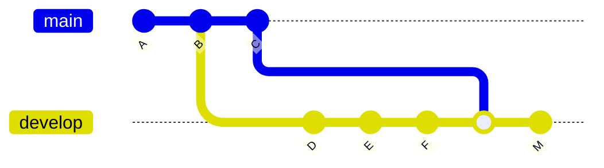

Este apunte contiene **mi chuleta sobre GIT**, varios recordatorios que utilizo como programador, comandos o situaciones más comunes. Viene bien por ejemplo cuando borro accidentalmente un fichero y quiero recuperarlo, consultar una versión anterior de código o ignorar una modificación en un archivo concreto.

<br clear="left"/>
<!--more-->



Recomiendo usar este contenido como *referencia*, asumiendo que conoces Git. Si quieres profundizar de verdad en Git te recomiendo este tutorial, un [apunte sobre GIT en detalle]()



---

## Básicos

Preparar el entorno y otros comandos básicos

```zsh
git config --global user.name "Don Quijote"
git config --global user.email "donquijote@email.com"

mkdir -p /home/proyectos/miproyecto
cd /home/proyectos/miproyecto
git init

cd /home/proyectos
git clone https://github.com/LuisPalacios/LuisPalacios.github.io

cd /home/proyectos/miproyecto
git status
```

---

### Tags

Algunos ejemplos sobre el uso de Tags

```zsh
$ git log --pretty=oneline
a7a05..d9114 (HEAD -> master, origin/master, origin/HEAD) Nueva versión
:
3f64b..37101 Versión terminada
ce5d4..1e621 Primer commit
$ git tag 1.0 3f64b           <== Aplicada al commit con hash 3f64b
$ git tag -d 1.0              <== La borro para añadirla de nuvo con anotación
$ git tag -a 1.0 -m "Primera versión operativa" 3f64b
$ git tag 2.0                 <== Aplica al último commit
$ git push origin 1.0         <== Envío tag o tags al origen.
$ git push origin --tags
```

---

### Alias

Ejemplos de alias que he probado. Normalmente solo configuro los dos primeros, de hecho el que mas uso es `git adog` que es fácil de recordar.

```zsh
git config --global alias.adog "log --all --decorate --oneline --graph"
git config --global alias.slog "log --graph --all --topo-order --pretty='format:%h %ai %s%d (%an)'"
git config --global alias.lo '!git --no-pager log --graph --decorate --pretty=oneline --abbrev-commit'
git config --global alias.lg '!git lg1'
git config --global alias.lg1 '!git lg1-specific --all'
git config --global alias.lg1-specific "log --graph --abbrev-commit --decorate --format=format:'%C(bold blue)%h%C(reset) - %C(bold green)(%ar)%C(reset) %s - %an %C(blue)%d%C(reset)'"
```

```zsh
git adog
git lg
```

---

### Checkout commit específico

De vez en cuando necesito ir a un commit específico, comprobar o probar algo y luego volver a donde estaba, la parte alta de mi rama. Supongamos que estoy en `main`, quiero irme a un commit concreto, compilar, probar y verificar algo y luego quiero volver a donde estaba (al último commit en main):

```zsh
# 1) Me voy al pasado ...
git checkout <hash-corto>

# 2) Trabajo en el commit, compruebo lo que sea...

# 3) Vuelvo al principio de mi rama
git checkout main
# nota: comando equivalente, que ahora es el recomendado...
git switch main
```

---

### Deshacer

Técnicamente consiste en *Volver a la versión anterior de un archivo de la working copy*. Muy útil cuando hemos borrado o  modificado un archivo por error y queremos deshacer por completo y volver a su versión anterior (la del último commit).  Ojo que es destructivo, vuelve a dejar el contenido anterior del fichero y lo que hayamos modificado se pierde...

```zsh
git restore Capstone/dataset/0.dataclean/datos.ipynb
```

---

### Git Rebase vs Merge

Cuando estás trabajando en tu rama, donde estás implementando una funcionalidad, es muy tipico que, mientras tanto, la rama `main` puede haber avanzado con nuevos cambios y llega el momento de querer sincronizar. Las dos formas más habituales son usar *rebase* o *merge*.

#### REBASE

**Rebase desde el CLI**: En el siguiente cuadro puedes ver un resumen.

Vamos a suponer que creo una rama `git checkout -b develop` estándo en el commit `B`, mientras tanto, `main` continúa evolucionando y tiene un nuevo commit (`C`).



Yo estaba en mi rama `develop`, y hago mis propios commits (`D, E, F`). Cuando quiero "ponerme al día", puedo actualizar mis referencias locales de todas las ramas remotas y hacer un `rebase` desde el último estado de `origin/main`. Reescribirá la historia, toma mis commits, los "desengancha" y los vuelve a aplicar (en mi rama) detrás de donde está `origin/main`, por lo que `D', E', F'` son **nuevas versiones reescritas** y se aplican tras `C`, como si la rama hubiese comenzado en ese punto.



**¿se puede predecir un posible conflicto?** La respuesta es que no, por cómo funciona `git rebase`, que aplica los commits uno por uno, el conflicto puede surgir en cualquiera de esos commits, y no se sabrá hasta que Git intente aplicarlo.

Lo que yo hago es ver qué probabilidades hay de conflicto. Ejecuto un merge en modo dry-run y si no me va a dar problemas, pues adelante con el rebase. Si se queja, entonces es muy probable que el rebase se queje, y en ese caso prefiero hacer un MERGE, me voy a la siguiente opción, descrita más abajo.

```bash
# Me bajo los últimos cambios de Origin sin aplicar nada
git fetch origin
# Compruebo probabilidad de conflicto
git merge --no-commit --no-ff origin/main
<... aqui nos dirá si ha ido bien o mal ...>
git merge --abort

# Si todo fue bien, pues hago el rebase
git rebase origin/main
git push --force-with-lease
```

**Qué pasa si hay conflictos?**:

No pasa nada, Git dará mensajes muy útiles. Te indica exactamente los archivos que tienen conflictos y te da las opciones para resolverlos. La clave es que el rebase se detiene en cada commit que causa un conflicto. El proceso es: resolver el conflicto, continuar el rebase, repetir el proceso si hay más conflictos en otros commits hasta que terminas.

- Identifica los archivos con conflicto
- Desde VSCode por ejemplo, edita el fichero con conflicto. Deja la versión que consideras buena y elimina el resto.

```cpp
<<<<< HEAD
// Tu código, lo que has hecho en tu rama
=======
// El código de la rama 'origin/main'
>>>>> addff7d5...
```

- Salva el fichero.
- Márcalo como resuelto > `git add fichero.txt` (lo haces añadiéndolo al stage)
- Repite con el resto de ficheros
- Continúa con el rebase `git rebase --continue`
- Repite con todos los commits con conflictos...
- Una vez que acabas, push **forzado** con `push --force-with-lease`

---

**Rebase desde GitKraken**: Mismo ejemplo pero desde esta aplicación

- Normalmente soy el único que trabaja en esta rama
  - 📌 **En GitKraken:**
    - En la barra lateral o el gráfico de commits busco la rama   develop
    - Clic derecho → **Checkout this branch**
- Entro en el ciclo de modificar, hacer commits y pushear
  - Cambios en el IDE
  - 📌 **En GitKraken:**
    - Pestaña **“Commit Panel”** (normalmente abajo a la izquierda)
    - Selecciona archivos modificados
    - Añade un mensaje
    - Haz clic en **“Stage all changes”**
    - Luego en **“Commit changes”**
    - Después pulsa **“Push”** en la barra superior
  - 🔁 Repito conforme avanzo.
- Actualizo las referencias locales de todas las ramas remotas (origin)
  - 📌 **En GitKraken:**
    - Botón **“Fetch”** en la parte superior.
    - Esto actualiza todas las referencias origin/* (incluyendo origin/main).
    - No cambia tu rama actual ni ninguna rama local.
- Hago rebase de mi rama sobre el último estado de origin/main
  - 📌 **En GitKraken:**
    - Me aseguro de estar en la rama (**checkout**)   develop.
    - En el gráfico de commits **localizo origin/main**
    - **Clic dcho. origin/main** → **“Rebase   develop onto origin/main”**
- Como ya había hecho push anteriormente en esta rama, ahora necesito un push forzado
  - 📌 **En GitKraken:**
    - Tras el rebase, el botón **“Push”** muestra un icono de ⚠️ (push no limpio).
    - Click en la flecha abajo de **Push** y elige **“Force Push (with lease)”**
    - ⚠️ Si hay conflictos, GitKraken te lo indicará visualmente y te permitirá resolverlos uno a uno en el panel lateral.

---

#### MERGE

**Merge desde el CLI**: En el siguiente cuadro puedes ver un resumen.

Vamos a suponer que creo una rama `git checkout -b develop` estándo en el commit `B`, mientras tanto, `main` continúa evolucionando y tiene un nuevo commit (`C`).



Entro en el ciclo de modificar mi rama, hago commits (`D, E, F`) y voy haciendo `push`. Cuando quiero "ponerme al día", actualizo referencias locales de todas las ramas remotas y fusiono lo que viene de main en mi rama, creando un nuevo commit.



Si hay conflictos los resuelvo, en caso contrario, subo este nuevo commit para sicronizar mi remoto de mi rama.

```bash
git fetch origin
git merge origin/main
git push
```

---

## GitHub CLI (`gh`)

El 95% de las veces uso el comando `git` para todo lo relacionado con Git, pero trabajamos mucho con GitHub y si tú también lo haces, te recomiendo instalarte [GitHub CLI](https://cli.github.com/), es un gran invento:

```shell
brew install gh  (MacOS)
apt install gh   (Ubuntu)
```

Trabaja siempre estando **Autenticado con un usuario concreto** y todas las operaciones las realiza usando un **Personal Access Token**. Si tienes más de una cuenta (personal y trabajo) deberás conmutar entre ellas según el repositorio en el que te encuentras.

### Configurar `ssh`

Imprescindible tener SSH bien configurado, tanto si tienes una única cuenta Personal como si tienes varias. Te recomiendo el apunte [Git multicuenta]() si tienes varias cuentas, es imprescindible tener perfectamente operativa tu configuración SSH para que `gh` se comporte como esperas.

### Configurar `gh` cuenta Personal

Este es el caso más habitual, solo trabajas con un usuario y lo único que necesitas es dar de alta tu PAT (Personal Access Token) e ir renovándolo cuando caduque.

- [Login en GitHub](https://github.com/login) con mi cuenta PERSONAL (`LuisPalacios`)
- [Generate New Token (Classic)](https://github.com/settings/tokens) desde Settings/Developer Settings.
  - El token necesita los permisos de 'repo', 'read:org', 'admin:public_key'.

<div class="image-box">
  
  <div class="image-caption">Permisos de mi PAT</div>
</div>

<div class="image-box">
  
  <div class="image-caption">Recuerda copiar el Token (PAT)</div>
</div>

- `gh auth status` Verifico estado (no debería estar autenticado con ningún usuario)

```zsh
🍏 luis@asterix:~ % gh auth status
You are not logged into any GitHub hosts. To log in, run: gh auth login
```

- `gh auth login` con mi cuenta personal, usando SSH y el token PAT del paso anterior

<div class="image-box">
  
  <div class="image-caption">gh auth login con cuenta personal, SSH y PAT</div>
</div>

Terminaste, si solo tienes una única cuenta en GitHub has terminado, puedes trabajar con `gh`, por ejemplo para, desde [GitHub, hacer la importación de un repositorio local existente](#github-hacer-importación-de-repositorio-local).

### Configurar `gh` cuenta Profesional

Este es un caso también habitual entre los desarrolladores. Tienes un par de cuentas, una privada para tus repos y otra que usas trabajando para Organizaciones (empresas). Te recomiendo este apunte sobre [gh trabajando con múltiples cuentas](https://github.com/cli/cli/blob/54d56cab3a0882b43ac794df59924dc3f93bb75c/docs/multiple-accounts.md). Se añadió soporte a esta modalidad a partir de la v2.40.0. Ah!, aunque lo mencioné antes, te recomiendo tener bien configurado SSH en este tipo de entorno multicuenta, échale un ojo al apunte [Git multicuenta]().

De nuevo, necesito dar de alta mi PAT (Personal Access Token) en mi cuenta profesional, e ir renovándolo cuando caduque. Lo creo y me lo guardo.

- [Login en GitHub](https://github.com/login) con mi cuenta PROFESIONAL (`EMPRESA-Luis-Palacios`)
- [Generate New Token (Classic)](https://github.com/settings/tokens) desde Settings/Developer Settings.
  - El token necesita los permisos de 'repo', 'read:org', 'admin:public_key'.

Verifico que efectivametne solo tengo dada de alta y autenticada una una única cuenta, la que configuré en el paso anterior.

```zsh
🍏 luis@asterix:~ % gh auth switch
✓ Switched active account for github.com to LuisPalacios
🍏 luis@asterix:~ % gh auth status
github.com
  ✓ Logged in to github.com account LuisPalacios (keyring)
  - Active account: true
  - Git operations protocol: ssh
  - Token: ghp_************************************
  - Token scopes: 'admin:public_key', 'read:org', 'repo'
```

- `gh auth login` con mi cuenta Profesional, usando SSH y el token PAT del paso anterior

```zsh
🍏 luis@asterix:~ % gh auth login
? What account do you want to log into? GitHub.com
? What is your preferred protocol for Git operations on this host? SSH
? Upload your SSH public key to your GitHub account? /Users/luis/.ssh/id_ed25519_git_EMPRESA-luis-palacios.pub
? Title for your SSH key: Clave SSH EMPRESA-Luis-Palacios para GitHub CLI
? How would you like to authenticate GitHub CLI? Paste an authentication token
? Paste your authentication token: ****************************************
- gh config set -h github.com git_protocol ssh
✓ Configured git protocol
✓ SSH key already existed on your GitHub account: /Users/luis/.ssh/id_ed25519_git_EMPRESA-luis-palacios.pub
✓ Logged in as EMPRESA-Luis-Palacios
```

- Podemos comprobar a partir de ahora en qué cuenta estamos y cambiar entre ellas

```zsh
🍏 luis@asterix:~ % gh auth status
github.com
  ✓ Logged in to github.com account EMPRESA-Luis-Palacios (keyring)
  - Active account: true
  - Git operations protocol: ssh
  - Token: ghp_************************************
  - Token scopes: 'admin:public_key', 'read:org', 'repo'

  ✓ Logged in to github.com account LuisPalacios (keyring)
  - Active account: false
  - Git operations protocol: ssh
  - Token: ghp_************************************
  - Token scopes: 'admin:public_key', 'read:org', 'repo'

🍏 luis@asterix:~ % gh auth switch
✓ Switched active account for github.com to LuisPalacios
🍏 luis@asterix:~ % gh auth switch
✓ Switched active account for github.com to EMPRESA-Luis-Palacios
🍏 luis@asterix:~ % gh auth switch
✓ Switched active account for github.com to LuisPalacios

```

## GitHub hacer importación de repositorio local

Si ya tenemos un repositorio en local, inicializado con GIT y queremos crear lo mismo en GitHub, pues solo tenemos que seguir la [documentación oficial](https://docs.github.com/en/migrations/importing-source-code/using-the-command-line-to-import-source-code/adding-locally-hosted-code-to-github). Básicamente hay dos formas de hacerlo:

- "[Adding a local repository to GitHub with GitHub CLI](https://docs.github.com/en/migrations/importing-source-code/using-the-command-line-to-import-source-code/adding-locally-hosted-code-to-github#adding-a-local-repository-to-github-with-github-cli)" - Lo puedes hacer todo desde tu ordenador, previa instalación del comando `gh`
- "[Adding a local repository to GitHub using Git](https://docs.github.com/en/migrations/importing-source-code/using-the-command-line-to-import-source-code/adding-locally-hosted-code-to-github#adding-a-local-repository-to-github-using-git)" - Necesitas trabajar en tu ordenador y en GitHub.

En este apunte describo la primera, con el GitHub CLI, que es la más cómoda. Tienes que instalar `gh` como puse arriba, [Preparar GitHub CLI](#github-cli-gh), y tenerlo bien configurado para tu cuenta (o cuentas) en GitHub.

- Creo un directorio para mi proyecto, o accedo a un directorio que tiene un proyecto y quiero importar

```shell
mkdir -p /Users/luis/00.git/02.github-luispa/zsh-zshrc
cd /Users/luis/00.git/02.github-luispa/zsh-zshrc
e README.md
e zsh-zshrc.sh
```

- Entro en el directorio e inicializo Git con `git init`

```shell
cd /Users/luis/00.git/02.github-luispa/zsh-zshrc
git init
git branch -M main           # Renombro desde master a main, es el estándar en GitHub
```

- Añadimos a la zona de staging y hacemos los commits que necesitemos..

```shell
cd /Users/luis/00.git/02.github-luispa/zsh-zshrc
e LICENSE  # Puedo seguir editando/añadiendo etc...
git add .
git config user.name "Luis Palacios"
git config user.email "micorreopersonal@personal.com"
git commit -m "primer commit"
```

- Ya estamos listos para subirlo. Uso `gh` para "subir" mi repositorio local a GitHub, en un solo comando.

```shell
cd /Users/luis/00.git/02.github-luispa/zsh-zshrc
gh repo create --description "Mi .zshrc" --remote=origin --source=. --public --push
✓ Created repository LuisPalacios/zsh-zshrc on GitHub
✓ Added remote git@github.com:LuisPalacios/zsh-zshrc.git
```

Si el remote es distinto (por ejemplo en el caso de mútiples usuarios) lo cambio

```zsh
git remote set-url origin gh-LuisPalacios:LuisPalacios/zsh-zshrc.git
```

---

## Github y Visual Studio Code basado en Web*

Si quieres trabajar con [VSCode desde tu navegador](https://docs.github.com/en/codespaces/the-githubdev-web-based-editor), directamente conectado culaquier repositorio alojado en GitHub, solo tienes que reemplazar `.com` por `.dev`. Si el repositorio es tuyo (has hecho login en GitHub) entonces tendrás derechos de edición y podrás hacer commits directamente. Un par de ejemplos:

- [https://github.dev/CiscoDevNet/netprog_basics](https://github.dev/CiscoDevNet/netprog_basics)
- [https://github.dev/LuisPalacios/LuisPalacios.github.io/tree/gh-pages](https://github.dev/LuisPalacios/LuisPalacios.github.io/tree/gh-pages)

---

## Agrupar commits en ORIGIN/main

Esto es PELIGROSO, DESACONSEJADO y solo recomendado SI TIENES MUY CLARO LO QUE ESTÁS HACIENDO. De hecho solo lo aconsejo en repo's tuyos donde no estás colaborando, para limpiarlos (de muchos commits). A veces nos puede interesar.

El caso de uso es cuando tengo una única rama `main` en GitHub y solo estoy yo como desarrollador, he hecho muchos, pero que muchos commits con pequeñas modificaciones, mal documentados y quiero "limpiar" porque me encuentro con una rama `main` bastante sucia.

- Voy a coger como ejemplo mi rama `main` de un proyecto llamado `refrescar`. Mi situación original es que mi repo tiene 48 commits y quiero hacer un `squash` de los últimos 45 commits (fusionar los últimos 45 commits en uno solo).

- Lo curioso del tema es que esos commits están ya en ORIGIN (es decir en GitHub).

- El primer paso es hacer un clone o asegurarme de que mi copia local está a la última, completamente sincronizada y sobre todo que NO HAYA NADIE (ningún otro desarrollador haciendo push a origin/main).

```zsh
🍏 luis@asterix:refrescar (main) % git pull
🍏 luis@asterix:refrescar (main) % git rev-parse --short HEAD
28f5b2d
🍏 luis@asterix:refrescar (main) % git ls-remote --quiet | grep HEAD | cut -c 1-7
28f5b2d

Estos son los hash de los 48 commits...

28f5b2d  oop                 48  <== último commit
:
483583a  update gitignore    4
86dc978  update readme       3
ddea7e7  Update README.md    2
326d415  Initial commit      1er commit
```

- Preparo el editor que usa `git`. Lo vamos a necesitar a continuación, durante la operación de `rebase`.

  `git config --global core.editor code`

- IMPORTANTE. Una vez que inicias el `rebase`, si ves problemas, aborta con: `git rebase --abort`

- Empieza la fiesta, hago un `rebase` de los últimos 45 commits

```zsh
🍏 luis@asterix:refrescar (main) % git rebase -i origin/main~45 main
```

- Se abrirá el editor automáticamente y mostrará todos los commits, desde el tercero #86dc978 (48-45=3) hasta el último #28f5b2d.

```txt
pick   86dc978 update readme     <== 3er commit (48-45)    \
squash 483583a update gitignore                            |
:                                                           > Fusionar
squash fe1dd07 oop                                         |
squash 28f5b2d oop               <== ÚLTIMO COMMIT         /
````

- En el editor aparecen todos los commits con la palabra `pick`. Ahora tengo que decidir, entre estas opciones:
  - pick: Mantiene el commit tal como está.
  - reword: Permite cambiar el mensaje del commit.
  - edit: Permite editar el contenido del commit.
  - squash: Combina este commit con el anterior, conservando ambos mensajes de commit.
  - fixup: Similar a squash, pero solo guarda el mensaje del commit anterior.
  - drop: Elimina el commit de la lista.

- Dejo la primera línea (3er commit histórico) con `pick 86dc978` y cambio todos los otros *pick's* a `squash`. Salvo el fichero y salgo del editor. Automáticamente intenta hacer lo que le hemos pedido, pero en mi caso detecta un conflicto (esto es normal y viene bien para que veas cómo resolverlo):

```zsh
🍏 luis@asterix:refrescar (main) % git rebase -i origin/main~45 main
Auto-fusionando 29-oop-rpg/src/programa.cpp
CONFLICTO (contenido): Conflicto de fusión en 29-oop-rpg/src/programa.cpp
error: no se pudo aplicar 357d14f... oop
hint: Resolve all conflicts manually, mark them as resolved with
hint: "git add/rm <conflicted_files>", then run "git rebase --continue".
hint: You can instead skip this commit: run "git rebase --skip".
hint: To abort and get back to the state before "git rebase", run "git rebase --abort".
hint: Disable this message with "git config advice.mergeConflict false"
No se pudo aplicar 357d14f... oop
```

- Edito el fichero con el conflicto en cuestión, resuelvo los conflictos y lo salvo.

```zsh
🍏 luis@asterix:refrescarA ● ●(main) rebase-i +?) % e 29-oop-rpg/src/programa.cpp
```

- Los marco como resueltos añadiendolos y continúo con el rebase

```zsh
🍏 luis@asterix:refrescarA ● ●(main) rebase-i +?) % git add .
🍏 luis@asterix:refrescarA ● ●(main) rebase-i +?) % git rebase --continue
```

- Podriá volver a ocurrir que hay conflictos, repito los pasos...

```zsh
🍏 luis@asterix:refrescar (main) % e fichero-con-conflicto...
🍏 luis@asterix:refrescar (main) % git add .
🍏 luis@asterix:refrescar (main) % git rebase --continue

Irá mostrando el editor y este proceso puede tardar un rato, depende de cuantos conflictos tengas...

```

- Llegará un momento donde dejas de tener conflictos, verás el mensaje `Rebase aplicado satisfactoriamente y actualizado refs/heads/main.`

```zsh
Rebase aplicado satisfactoriamente y actualizado refs/heads/main.
🍏 luis@asterix:refrescar (● main ↕) % git status
En la rama main
Tu rama y 'origin/main' han divergido,
y tienen 1 y 46 commits diferentes cada una respectivamente.
  (use "git pull" if you want to integrate the remote branch with yours)

nada para hacer commit, el árbol de trabajo está limpio
```

- Ahora llegamos al punto crítico. Vamos a mandar a ORIGIN/main nuestra copia haciendo un FORCE PUSH

```zsh
🍏 luis@asterix:refrescar (● main ↕) % git push origin +main
Enumerando objetos: 117, listo.
Contando objetos: 100% (117/117), listo.
Compresión delta usando hasta 12 hilos
Comprimiendo objetos: 100% (105/105), listo.
Escribiendo objetos: 100% (114/114), 30.13 KiB | 10.04 MiB/s, listo.
Total 114 (delta 19), reused 82 (delta 8), pack-reused 0 (from 0)
remote: Resolving deltas: 100% (19/19), completed with 1 local object.
To github.com-LuisPalacios:LuisPalacios/refrescar.git
 + 5a42ca6...96b4c8d main -> main (forced update)
```

- Muestro el log de mis commits

```zsh
🍏 luis@asterix:refrescar (main) % git log --all --decorate --oneline --graph
* 96b4c8d (HEAD -> main, origin/main, origin/HEAD) Commit agregado de 45 commits final
* ddea7e7 Update README.md
* 326d415 Initial commit
```

- El repo queda ya con solo 3 commits !!

<div class="image-box">
  
  <div class="image-caption">Repositorio final</div>
</div>

- Los commits que han quedado son:

```zsh
96b4c8d  Commit agregado de 45 commits     3er  <== COMMIT que agrega todo
ddea7e7  Update README.md                  2o
326d415  Initial commit                    1er commit
```

---

||
|-|
| Nota: **ATENCIÓN !!!! Es muy importante que el resto de desarrolladores borren su copia local o hagan un reset de su clone actual** |
||

Si otro desarrollador hace un push (--force) desde una rama local (antigua) volverán a aparecer todos los commits. La recomendación es volver a hacer una de las opciones siguientes:

1. Borrar el repositorio local y volver a hacer un clone

2. Reset del respositorio local y pull. A continuación muestro un ejemplo, tenía el repositorio ANTIGUO copiado en "refrescar.old"

```zsh
🍏 luis@asterix:refrescar.old (● main ↕) % git reset --hard origin/main
HEAD está ahora en 96b4c8d Commit agregado de 45 commits final
🍏 luis@asterix:refrescar.old (main) % git clean -xdf
🍏 luis@asterix:refrescar.old (main) % git pull
Ya está actualizado.

🍏 luis@asterix:refrescar.old (main) % git log --all --decorate --oneline --graph
* 96b4c8d (HEAD -> main, origin/main, origin/HEAD) Commit agregado de 45 commits final
* ddea7e7 Update README.md
* 326d415 Initial commit
```

---

## Cambiar Autor de commits

Esto es PELIGROSO, DESACONSEJADO y solo recomendado SI TIENES MUY CLARO LO QUE ESTÁS HACIENDO. El caso de uso es cuando tenemos muy claro que el nombre (y/o email) del autor de commits es erroneo.

Usaremos el comando `git filter-branch` que reescribe el historial del repositorio, por lo que debes tener cuidado y hacer un respaldo del repositorio antes de realizar estos cambios.

### Repasar commit

Para averiguar el mail con el que se hizo un determinado commit:

```zsh
git show -s --format='%ae' <HASH corto del commit>
```

Para repasar quién hizo los commits:

```zsh
git log --pretty=format:"%h %ce %ae"| grep -i <nombre o email>
```

### Renombrar autor/email de los commit

Navega a tu repositorio y asegúrate que lo tienes actualizado

```zsh
cd /ruta/al/repositorio/mirepo
git pull
```

Te recomiendo que hagas una copia de seguridad

```zsh
cp -r /ruta/al/repositorio/mirepo /ruta/al/respaldo/mirepo.bak
```

Utiliza `git filter-branch` para cambiar el nombre + email del autor en todos los commits:

```zsh
git filter-branch --env-filter '
OLD_EMAIL="email_incorrecto@ejemplo.com"
CORRECT_NAME="Nombre Correcto"
CORRECT_EMAIL="email_correcto@ejemplo.com"

if [ "$GIT_COMMITTER_EMAIL" = "$OLD_EMAIL" ]
then
    export GIT_COMMITTER_NAME="$CORRECT_NAME"
    export GIT_COMMITTER_EMAIL="$CORRECT_EMAIL"
fi
if [ "$GIT_AUTHOR_EMAIL" = "$OLD_EMAIL" ]
then
    export GIT_AUTHOR_NAME="$CORRECT_NAME"
    export GIT_AUTHOR_EMAIL="$CORRECT_EMAIL"
fi
' --tag-name-filter cat -- --branches --tags
```

El comando anterior crea una copia de seguridad bajo `.git/refs/original/*`. Es muy buena idea tenerla para el caso de que hayas hecho algo mal. Recomiendo inspeccionar que todo ha ido bien, con el comando siguiente:

```zsh
git log
```

Una vez revisado, haz push de los cambios al repositorio remoto

```zsh
git push --force --tags origin 'refs/heads/*'
```

Cuando terminas y estas seguro de que todo está bien puedes eliminar la copia de seguridad de la referencia (en mi caso, en este ejemplo el nombre de la rama es `main`)

```zsh
git update-ref -d refs/original/refs/heads/main
```
