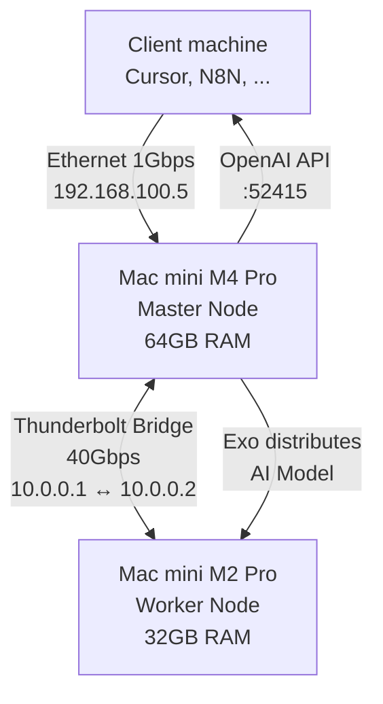

How I set up a cluster with a couple of Macs in my home lab to have a **Distributed Inference Server**, the equivalent of a mini OpenAI data center at home. I'll use a pair of Mac Minis and the **[Exo](https://github.com/exo-explore/exo)** software. My two use cases are: software development from a third machine with Cursor and automations with N8N.

The ultimate goal is for Cursor and N8N to use my cluster instead of consuming paid tokens (savings and privacy). With a Mac mini M4 Pro (64GB) and a Mac mini M2 Pro (32GB) I'll have 96GB of Unified Memory available. Exo will leverage that to run whichever model I've chosen. As an example I pick the **Qwen 2.5 72B** model, state-of-the-art for code generation ("Open Weights"), but any similar model would work.

<br clear="left"/>
<!--more-->

## General Architecture and Concepts

These are the different deployment models for running LLMs at home:

- **Single server**: The simplest option, a single machine with enough RAM/VRAM to load the complete model. Works well for small or medium models, but has clear physical limitations when you need more capable models.
- **Mixed GPU/CPU nodes**: Combining machines with dedicated GPUs (NVIDIA with CUDA, AMD with ROCm) with CPU-only machines. Requires more configuration but maximizes the use of available resources.
- **Home cluster**: Multiple nodes working together to distribute the model load. This is what I'm building, allowing me to leverage resources from several machines and scale horizontally.

In the Cluster I use **Exo**, which integrates perfectly into this architecture because it's designed specifically for "painless" distributed inference. Unlike running the model locally on a single machine, distribution across nodes allows combining RAM/VRAM from several machines, parallelizing inference and adding more nodes (old Macs, for example) as needs grow.

With a single Mac M4 (64GB) I could safely run models up to ~50GB, but with the two-Mac cluster (96GB combined) I can run models up to ~77GB in 8-bit quantization, which means drastically superior response quality.

### Architecture Diagram



## Hardware Requirements

To build a distributed inference cluster you need to consider several aspects:

### Memory: the critical factor

For running LLM models, **available memory is the most critical factor**, not CPU speed. Depending on the model size you want to run:

- **Small models (7B-13B)**: 16-32GB total memory - Could run solely on the Mac mini Pro M2 with 32GB.
- **Medium models (30B-40B)**: 32-64GB total memory - Could run solely on the Mac mini Pro M4 with 64GB.
- **Large models (70B+)**: 64GB+ total memory (ideally distributed) - Here I'll need both machines and create the cluster

On Apple Silicon (M1/M2/M3/M4): Memory is unified (Unified Memory), shared between CPU and GPU. This means there's no separation between "CPU RAM" and "GPU VRAM": the entire model loads into the same memory, and both CPU and GPU access it directly without copying data. This configuration is ideal for LLM inference because it's very fast, natively supports MLX (Apple's optimized framework) and has low power consumption, much lower than a dedicated GPU like the NVIDIA RTX 4090.

On systems with dedicated GPU (NVIDIA/AMD): What's critical is the GPU's VRAM, not the system RAM. The model loads primarily into VRAM, and system RAM is only used for buffers and auxiliary data, which makes hardware much more expensive.

Compatible GPUs:

- Apple Silicon (M1/M2/M3/M4): Native support with MLX, no additional drivers.
- NVIDIA with CUDA: Requires NVIDIA drivers and CUDA toolkit.
- AMD with ROCm: Requires AMD drivers and ROCm installed.
- No GPU (CPU only): Works, but it's much, much slower (unfeasible for real-time chat).

### Thermal and power considerations

Keeping both Macs running constantly has its implications. Each Mac mini consumes ~20-30W idle, ~50-80W under load, so I estimate ~100-160W constant, requiring good ventilation. The good news is I won't use it constantly, I can power them off when not in use, or let them sleep and use wake-on-LAN to start them on demand. Just as an additional note, if in the future I needed more nodes, each additional node needs to connect to the cluster (Thunderbolt, Ethernet, or both), `exo` will detect it automatically, the model distributes across all available nodes. The only issue I see is that bridging TB between two macs is easy, between three I start running out of ports.

## My setup

My current configuration

- **Master Node**: Mac mini M4 Pro with 64GB Unified Memory
  - I'll start the Exo Master here
  - Exposes the HTTP API for potential clients to connect
  - Manages model distribution

- **Worker Node**: Mac mini M2 Pro with 32GB Unified Memory
  - Acts as VRAM memory expansion
  - Receives model parts from the Master
  - Processes distributed inferences

- **Exo**: Distributed inference engine that manages communication between nodes

- **Clients**:
  - **Cursor**: Development IDE
  - **N8N**: Visual workflow automation platform
  - **Others**: Anything that supports connecting via the OpenAI API.

### Load balancing and model distribution

Exo automatically distributes the model across available nodes. In my case:

- A model like Qwen 2.5 72B (8-bit, ~77GB) splits between both Macs
- The Master manages coordination and exposes the API
- The Worker processes its part of the model
- Communication between nodes uses Thunderbolt Bridge for maximum speed

We have some limitations: **network latency**, although Thunderbolt is fast, it always adds overhead; **complexity**, more failure points; **power consumption**, double electricity and thermal output; and **synchronization**, they must be synchronized, if one fails, the cluster degrades. Additionally there's the limitation of **memory consumed by macOS and not being able to limit the memory available for Exo**, which can lead to Exo trying to grab **all** available memory and, being so close to the physical limit, crashing. In the section about tricking the M2 Pro you'll see how to solve this.

Regarding shared storage, **it's not needed**, the Master downloads the model and sends it to the Worker. In my case I even download them manually and send them to both, to speed things up and avoid issues.

Clients connect to the Master via HTTP (port 52415), which coordinates with the Worker via Thunderbolt and everything is transparent, appearing as a single local OpenAI server.

## Network Configuration

For the AI to respond quickly, we need the 20-40 Gbps of the Thunderbolt cable. I connected a **Thunderbolt 4** cable (high-speed USB-C) directly between both and configured static IPs. Then I configure `exo` to use the Thunderbolt Bridge, not the regular Ethernet network:

- On both Macs go to **System Preferences > Network**
- Select the **"Thunderbolt Bridge"** interface (important: NOT the one that says "Thunderbolt Ethernet", but "Thunderbolt Bridge")
- Configure static IPs:
  - **Mac M4 (Master)**:
    - IP Address: `10.0.0.1`
    - Subnet mask: `255.255.255.0`
    - Router: (leave empty)
  - **Mac M2 (Worker)**:
    - IP Address: `10.0.0.2`
    - Subnet mask: `255.255.255.0`
    - Router: (leave empty)

The port appears in `unknown state`, this is correct. Try a `ping 10.0.0.x`, response times should be under 0.5ms, confirming the Thunderbolt link is working correctly. To verify the Thunderbolt Bridge link is actually leveraging the full bandwidth (~40 Gbit/s), I run a performance test with `iperf3`. I install on both with `brew install iperf3` and run:

- On the **Worker** Mac (M2), acting as server: `iperf3 -s`
- On the **Master** Mac (M4), acting as client (basic): `iperf3 -c 10.0.0.2`
- On the **Master** Mac (M4), acting as client (realistic): `iperf3 -c 10.0.0.2 -P 4 -t 30`

If the results consistently show around **35-38 Gbit/s**, the Thunderbolt Bridge link can be considered to be working at its practical maximum capacity.

## Optimization and Quantization

To understand how to optimize performance, I need to explain what **Quantization** is. It's a technique that reduces the precision of model weights so they take up less memory. Instead of using 16-bit numbers (FP16), we use fewer bits:

- Q4 (4-bit): Each weight uses 4 bits, reduces size ~70%.
- Q8 (8-bit): Better quality, reduces size ~50% compared to FP16.

Trade-off: Fewer bits = smaller model but potentially "less intelligent". For code development (especially C++), I prefer quality over size, which is why I use 8-bit when the combined memory allows it.

To measure cluster performance I'll focus on two things:

- Tokens per second: How many tokens it generates per second (target: >10 tokens/s for comfortable human reading).
- Time to first token (TTFT): Time until it starts generating.

## Exo

**Exo** is a distributed inference engine designed to run LLMs efficiently on multiple nodes. It's written in Python, requires minimum **Python 3.13**. For MLX and Apple Silicon projects, the most solid and recommended version right now is Python 3.13.

On both Macs I make sure to have the development environment and Homebrew properly configured. Check out this [post]() about software development on Mac.

```bash
# Make sure I have the development environment
xcode-select --install
```

```bash
# If you don't have Homebrew, install it
/bin/bash -c "$(curl -fsSL https://raw.githubusercontent.com/Homebrew/install/HEAD/install.sh)"
```

```bash
# I installed `huggingface-cli` (only on the Master)
brew install huggingface-cli
```

```bash
# I install git-lfs and macmon (Monitor for macOS) to read temperature, GPU
# usage and RAM of Apple Silicon in real time.
brew install git-lfs macmon

# I install rust (option 1 and restart the shell)
curl --proto '=https' --tlsv1.2 -sSf https://sh.rustup.rs | sh

# I add the following to my .zshrc
# . "$HOME/.cargo/env"

# Exit and re-enter the Terminal and verify the installation
rustc --version
rustc 1.91.1 (ed61e7d7e 2025-11-07)
```

```bash
# I install stable python 3.13 (will coexist with whatever python I already have)
brew install python@3.13

# Clone the exo project
cd ~/
git clone https://github.com/exo-explore/exo.git

# Activate the environment using python 3.13
cd ~/exo
/opt/homebrew/bin/python3.13 -m venv .venv
source .venv/bin/activate
python3 --version
Python 3.13.11
```

```bash
## Install additional libraries
brew install libjpeg zlib
```

```bash
# You shouldn't need the following exports.
# I leave them here commented just in case. You don't need them because with python 3.13 it will find
# the already compiled versions
#
## Configure variables so the compiler can find them (only needed if it compiles)
#export LDFLAGS="-L/opt/homebrew/opt/zlib/lib -L/opt/homebrew/opt/libjpeg/lib"
#export CPPFLAGS="-I/opt/homebrew/opt/zlib/include -I/opt/homebrew/opt/libjpeg/include"
#export PKG_CONFIG_PATH="/opt/homebrew/opt/zlib/lib/pkgconfig:/opt/homebrew/opt/libjpeg/lib/pkgconfig"

# Update pip and base tools
python -m pip install -U pip setuptools wheel

# Install prior dependencies (optional, but helps prevent errors)
python -m pip install mlx sentencepiece

# I ran into another issue that's also not needed, but I leave it commented just in case
# it reappears. I had to apply a fix in the setup.py file
#sed -i '.bak' 's|mlx==0.22.0|mlx==0.30.0|g' setup.py

# Install the Rust engine (bindings)
python -m pip install -e ./rust/exo_pyo3_bindings

# Install Exo !!!
python -m pip install -e .
```

When Exo is installed from source, the web interface (built in React/JavaScript) doesn't come pre-compiled. Exo's Python code will try to find the folder with the generated HTML/JS to serve the web; it's important to have them because if they're not found, it will crash and cause Rust to panic. The recommended option is to compile the Dashboard:

```bash
brew install node
cd ~/exo/dashboard
npm install
npm run build   # ignore warnings, if it says - Wrote site to "build" - at the end, it finished successfully
```

### Exo Configuration

File `~/.exo/exo.yaml` on the Master

```yaml
server:
  # File for the MASTER
  host: "0.0.0.0"  # Listen on all interfaces
  port: 52415      # Default port

models:
  cache_dir: "~/.exo/models"  # Where to store downloaded models
  default_format: "mlx"       # Preferred format for Apple Silicon

cluster:
  # I set discovery to manual and the peer address so they connect quickly
  discovery: "manual"
  network_interface: "10.0.0.1"  # Use Thunderbolt Bridge
  peers:
    - "10.0.0.2:52415"           # Worker address

logging:
  level: "INFO"                # Logging level
```

File `~/.exo/exo.yaml` for the Worker

```yaml
server:
  # File for the WORKER
  host: "10.0.0.2"
  port: 52415

models:
  cache_dir: "~/.exo/models"
  default_format: "mlx"

cluster:
  # I set discovery to manual and the peer address so they connect quickly
  discovery: "manual"
  network_interface: "10.0.0.2"  # Use Thunderbolt Bridge
  peers:
    - "10.0.0.1:52415"           # Master address

logging:
  level: "INFO"
```

I create a couple of scripts, one for each node, copy them somewhere in my PATH and make them executable

**`exo_start_master.sh`** (for the Master node - M4):

```bash
#!/bin/bash
echo "Starting Cluster Master (M4)..."
echo "Killing old exo processes..."
pkill -f "python -m exo" || true
pkill -f "exo" || true
# Wait a second to release the port
sleep 2

# Navigate to the project directory and activate the virtual environment
cd ~/exo
source .venv/bin/activate
export EXO_LOG_LEVEL="WARNING"
exo
```

**`exo_start_worker.sh`** (for the Worker node - M2):

```bash
#!/bin/bash
echo "Killing old exo processes..."
pkill -f "python -m exo" || true
pkill -f "exo" || true
# Wait a second to release the port
sleep 2

echo "Starting Worker Node (M2)..."
cd ~/exo
source .venv/bin/activate
export EXO_LOG_LEVEL="WARNING"
exo
```

```bash
chmod +x exo_start_master.sh
chmod +x exo_start_worker.sh
```

### Tricking the M2 Pro

This is where I hit a wall. When trying to load one of the models (specifically `Llama-3.3-70B-Instruct-8bit`), Exo calculates how to split it. By default, Exo uses a partitioning strategy based on total RAM. It sees the M2 has 32GB and decides to assign ~33% of the model (23.1GB). The result? Since macOS needs memory for the OS ("Wired memory"), the GPU (UI) and other apps (even though I have none running when I start Exo), it may NOT have those 23.1GB free, and at launch macOS kills the process for "Out Of Memory" (OOM) and the Worker crashes.

The solution: Lie to Exo. It's currently in alpha, it doesn't have a simple configuration flag to limit maximum memory (like --max-memory 24GB). So I had to modify the source code on the Worker (M2 Pro) so it reports less memory than it actually has. I edited the file `exo/src/exo/shared/types/profiling.py` and applied this hack:

```python
@classmethod
    def from_psutil(cls, *, override_memory: int | None) -> Self:
        vm = psutil.virtual_memory()
        sm = psutil.swap_memory()

        # --- HACK START: Force M2 Pro to report only 28GB ---
        # 28*1024*1024*1024 = 30064771072
        # Replace vm.total with this limit
        fake_total_ram = 30064771072
        # ---------------------------------------------------------

        return cls.from_bytes(
            ram_total=fake_total_ram,  # <--- CHANGED (was vm.total) !!!!!!!!!!!!!!!!
            ram_available=vm.available if override_memory is None else override_memory,
            swap_total=sm.total,
            swap_available=sm.free,
        )
```

The Worker will report 28GB. Therefore the Cluster will have 28+64=92, meaning the M2 will only get 30% (28/92) of the model, i.e. 70*0.3 = 21GB, leaving 49GB for the M4, which will "probably" fit in their memories. You can adjust as needed.

### Running Exo

I run the scripts. The order matters, Worker first, then Master:

- On my Mac M2 (Worker) -> `exo_start_worker.sh`
- On the other Mac M4 (Master) -> `exo_start_master.sh`

I connect to the Dashboard at [http://192.168.100.5:52415/](http://192.168.100.5:52415/)

<div class="image-box">
  
  <div class="image-caption">Exo Dashboard</div>
</div>

From the web UI:

- In Instances I select the model *Qwen3-30B-A3B-8bit*
- I click LAUNCH in the box with two nodes
- It will download the model from [HuggingFace](https://huggingface.co/) and send it to the Worker (M2)
- When it finishes, Instances shows it as Ready.

You can now chat from the Dashboard!

### Manual model download

Once you've played with a simple model and with Exo, I started looking for other models. Choosing the right model based on available hardware is crucial. In my case, I want to be able to load for **software development** or for general purpose **MoE** (Mixture of Experts) to help with N8N automation.

I search for models on **[HuggingFace](https://huggingface.co/)**, a platform that hosts thousands of pre-trained AI models. It's like the "GitHub of AI models". Models are organized in repositories. I search for optimal Mac Mini Silicon models in [the MLX community on HuggingFace](https://huggingface.co/mlx-community), specifically in [MLX Community's collections](https://huggingface.co/collections/mlx-community). On the left you'll see a list of collections and clicking on each one shows the available models.

| Model | Description | Notes |
| ------ | ----------- | ----------- |
| mlx-community--Qwen2.5-72B-Instruct-8bit | Qwen 2.5 72B Instruct. MLX format (Apple Silicon Native). 8-bit quantization (Preferred) or 4-bit (Fallback) | I've used this for testing |
| mlx-community--Qwen3-30B-A3B-8bit | MoE (Mixture of Experts). "30B-A3B" means it has 30 Billion total parameters, but only 3 Billion Active (A3B) per token. It takes up considerable disk/RAM (like a 30B model), but runs very fast (as if it were a small 3B model). | Happy running it only on the Mac M4 with 64GB because it fits |
| Qwen3-30B-A3B-Instruct-8bit | Same version but prepared for chat/instructions, which tends to be better for interaction | xx |
| Qwen Others | [Check mlx communities](https://huggingface.co/collections/mlx-community/qwen3-coder-moe) | xx |

I download them with huggingface-cli (`hf` which I installed above with `brew install huggingface-cli`). Some download examples:

```bash
hf download mlx-community/Qwen3-30B-A3B-8bit --cache-dir ~/.exo/models
hf download mlx-community/Qwen3-30B-A3B-Instruct-8bit --cache-dir ~/.exo/models
hf download mlx-community/Llama-3.3-70B-Instruct-8bit --cache-dir ~/.exo/models
hf download mlx-community/Qwen3-Coder-30B-A3B-Instruct-8bit  --cache-dir ~/.exo/models
hf download mlx-community/Qwen3-Coder-480B-A35B-Instruct-4bit --cache-dir ~/.exo/models
hf download mlx-community/GLM-4-32B-Base-0414-8bit --cache-dir ~/.exo/models
hf download mlx-community/Codestral-22B-v0.1-8bit --cache-dir ~/.exo/models

hf download mlx-community/Llama-4-Scout-17B-16E-Instruct-8bit --cache-dir ~/.exo/models

hf download mlx-community/LFM2-8B-A1B-fp16 --cache-dir ~/.exo/models

```

One downside of `hf` is that it leaves the model in a different structure than what *Exo* expects:

```bash
sh-3.2$ ls -1 ~/.exo/models
:
mlx-community--Qwen3-30B-A3B-8bit                    <== This is how Exo downloaded it
models--mlx-community--Llama-3.3-70B-Instruct-8bit   <== This is how the hf command downloads it manually
```

Exo doesn't see the one downloaded with `hf` because it has its own sub-directory and file format, so you need to manipulate it.

```bash
# Example of downloading and manipulating a model to match Exo's expected format
hf download mlx-community/Llama-3.3-70B-Instruct-8bit --cache-dir ~/.exo/models
cd ~/.exo/models
mkdir mlx-community--Llama-3.3-70B-Instruct-8bit
cd models--mlx-community--Llama-3.3-70B-Instruct-8bit/snapshots/*
cp -L * ../../../mlx-community--Llama-3.3-70B-Instruct-8bit
cd ~/.exo/models
rm -rf models--mlx-community--Llama-3.3-70B-Instruct-8bit
```

The next step is sending it to the Worker:

```bash
# From Master I launch the copy against the THUNDERBOLT IP !!! so it goes through the fast channel
models ❯ scp -r ~/.exo/models/mlx-community--Llama-3.3-70B-Instruct-8bit luis@10.0.0.2:.exo/models
model-00014-of-00015.safetensors                                   100% 4964MB 732.9MB/s   00:06
model-00011-of-00015.safetensors                                   100% 5117MB 743.7MB/s   00:06
model-00009-of-00015.safetensors                                    45% 2242MB 749.7MB/s   00:03 ETA
:
```

Once you download models and have them on both nodes, you can start *Exo* on the Master and Worker and they'll appear in the available models list. Here's an example with a larger prompt (*Llama 3.3 70B (8-bit) 70GB*) that was distributed between both machines. You can see how it distributed the load, raises the temperature on both machines and delivers a speed of about 3 tokens per second, which although slow, lets you play, learn and experiment with distributed AI in a relatively cheap way.

<div class="image-box">
  
  <div class="image-caption">Requesting a small C++ program</div>
</div>

## Client Configuration

Once we have everything working, I'll try configuring a couple of clients.

### Cursor Configuration

- Cursor -> **Settings** (Gear icon) -> **Models**.
- Add Custom Model: `mlx-community/Llama-3.3-70B-Instruct-8bit` (must match exactly what we see in *Exo*)
- API Keys:
  - **API Key**: Put anything
  - **Override OpenAI Base URL**: `http://192.168.100.5:52415/v1`

From the Cursor Chat window I select "Agent" > `mlx-community/Llama-3.3-70B-Instruct-8bit`

As soon as you try a Chat you'll see one of Cursor's "serious" problems: by default it blocks local IPs. I can't tell it that the "custom" server is at `http://192.168.100.5:52415` (where I'll have `exo`), I can't even trick it with an SSH tunnel, or with DNS names. To solve this I use `ngrok`. I signed up, copied the Token and on the Master (the machine where I listen on port 52415), I run ngrok:

```bash
# Authenticate with ngrok using the token
ngrok config add-authtoken YOUR_TOKEN_HERE

# Run ngrok
ngrok http 52415
```

- Several data points will appear, including "Forwarding". I copy that URL

```bash
# Example
Forwarding:  https://semimagnetical-pseudoscience-pepito.ngrok-free.dev   -->  http://localhost:52415
                   |
                   +--> This is the URL I need to put in **Override OpenAI Base URL** in Cursor
```

Test prompt in Cursor in an empty project:

```text
Write a short poem about a distributed AI cluster in the poem.md file in markdown format, in english.
```

### What to observe

**Speed**: Should be fluid, approximately **10-20 tokens/second** thanks to Thunderbolt. If it's much slower (<5 tokens/s), there may be a network or configuration issue.

**Activity Monitor**:

- On the **Mac M4**: You should see RAM at 80-90% usage (or whatever its model portion requires)
- On the **Mac M2**: You should see a peak in RAM usage when tokens are generated (Exo moves data between them dynamically)

**Quality**: The generated code should:

- Compile without errors
- Use modern C++20 syntax (`requires`, `std::move`, `std::mutex`)
- Demonstrate understanding of smart pointers and memory management
- Be logically correct

If the code doesn't compile or has obvious logical errors, the model may not be loaded correctly or there may be a problem with distribution between nodes.

## Comparison with Other Solutions

For homelabs, there are several options. Here's my honest comparison:

| Solution | Advantages | Disadvantages | Best for |
| :--- | :--- | :--- | :--- |
| **Exo** | Automatic distribution, easy setup, native MLX | Less mature, smaller community | Apple Silicon clusters |
| **Ollama** | Very easy to use, large community | Doesn't support native multi-node distribution | Single machine |
| **LM Studio** | Graphical interface, easy for beginners | Windows/Mac only, no distribution | Non-technical users |
| **Oobabooga** | Very configurable, many formats | Complex, typically requires NVIDIA GPU | Advanced users with NVIDIA |
| **vLLM** | Very fast, optimized for production | Complex, requires NVIDIA GPU | Production with NVIDIA |

**My choice of Exo** is because:

- Supports native multi-node distribution (crucial for my setup)
- Optimized for Apple Silicon with MLX
- OpenAI-compatible API (works with Cursor without modifications)
- Relatively simple setup for what it offers

## Other Uses and Use Cases

The cluster isn't just for Cursor. I can use it for:

### Local endpoint compatible with OpenAI API

Any application that uses the OpenAI API can connect to my cluster:

- **ChatGPT clients**: Alternative clients that support custom API
- **Custom applications**: Python, Node.js scripts, etc. that use the API
- **Automated workflows**: Integrations with other tools

### Local agents and workflows

I can build agents that use the cluster for:

- Automated code analysis
- Documentation generation
- Assisted refactoring
- Automated testing

### Integrations

- **Home Assistant**: Integrate the LLM with home automation for natural voice commands
- **VSCode**: Similar to Cursor, configure VSCode to use the cluster
- **Custom applications**: Develop apps that consume the cluster

The possibilities are endless, limited only by imagination and needs.

## Automation and Maintenance

For the cluster to be useful long-term, I need to automate some tasks.

### Automate model updates

Models on HuggingFace are periodically updated. To update:

```bash
# Clean model cache
rm -rf ~/.exo/models/mlx-community/Qwen2.5-72B-Instruct-8bit

# Run again (will download the most recent version)
exo run mlx-community/Qwen2.5-72B-Instruct-8bit
```

I can automate this with a cron script or a systemd (on Linux) or launchd (on macOS) service.

### Persist configurations

Important configurations (IPs, ports, paths) I keep in:

- `~/.exo/exo.yaml`: Exo configuration
- Startup scripts: To reproduce the setup easily
- Documentation: This very post

### Monitor usage and temperature

To monitor the cluster:

- **Activity Monitor** (macOS): View RAM, CPU usage, temperature
- **Custom scripts**: Use `sysctl`, `iostat`, etc. for metrics
- **Alerts**: Configure notifications if temperature gets too high or a node fails

### Backups and restoration

Although I don't store critical persistent data, I back up:

- Configurations (`exo.yaml`, scripts)
- List of downloaded models (so I don't have to download them again)
- Setup documentation

To restore, I just need to:

1. Reinstall Exo
2. Restore configurations
3. Models download automatically when I run them

## Conclusion

Building a distributed AI cluster at home with two Macs and Exo has allowed me to have the equivalent of a mini OpenAI data center in my homelab. With 96GB of combined Unified Memory, I can run large models like Qwen 2.5 72B in 8-bit quantization, getting excellent response quality for code development, especially C++. The 40Gbps Thunderbolt Bridge connection ensures minimal latency between nodes, and the integration with Cursor is transparent: it works as if it were an online OpenAI server, but running locally without consuming tokens. If you have several Macs and want to leverage them for AI, this is an excellent way to do it.

## Useful Links

- [Exo - Distributed Inference Server](https://github.com/exo-lang/exo) - Official Exo repository
- [MLX - Machine Learning Framework for Apple Silicon](https://github.com/ml-explore/mlx) - MLX framework optimized for Apple Silicon
- [Qwen 2.5 72B on HuggingFace](https://huggingface.co/mlx-community/Qwen2.5-72B-Instruct-8bit) - Qwen 2.5 72B model in MLX format
- [Cursor IDE](https://cursor.sh/) - IDE with local LLM support
- [HuggingFace](https://huggingface.co/) - AI model platform
