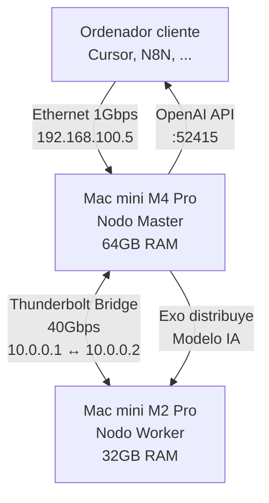

Cómo he montado en mi home lab un cluster con un par de Macs para tener un **Servidor de Inferencia Distribuido**, el equivalente a un mini centro de datos de OpenAI en casa. Usaré un par de Mac Mini's y el software **[Exo](https://github.com/exo-explore/exo)**. Mis casos de uso son dos: desarrollo de software desde un tercer equipo con Cursor y automatizaciones con N8N.

El objetivo final es que Cursor y N8N usen mi cluster en vez de consumir tokens de pago (ahorro y privacidad). Con un Mac mini M4 Pro (64GB) y un Mac mini M2 Pro (32GB) tendré disponible 96GB de Unified Memory. Eso lo va a aprovechar Exo para poder ejecutar el modelo que haya elegido. Escojo como ejemplo el modelo **Qwen 2.5 72B**, de vanguardia para generación de código ("Open Weights"), pero valdría cualquiera similar.

<br clear="left"/>
<!--more-->

## Arquitectura general y conceptos

Estos son los diferentes modelos de despliegue posibles para ejecutar LLMs en tu casa:

- **Un solo servidor**: La opción más simple, un único equipo con suficiente RAM/VRAM para cargar el modelo completo. Funciona bien para modelos pequeños o medianos, pero tiene limitaciones físicas claras cuando necesitas modelos más capaces.
- **Nodos GPU/CPU mixtos**: Combinar equipos con GPU dedicada (NVIDIA con CUDA, AMD con ROCm) con equipos que solo tienen CPU. Requiere más configuración pero maximiza el uso de recursos disponibles.
- **Cluster doméstico**: Múltiples nodos trabajando juntos para distribuir la carga del modelo. Es lo que estoy montando yo, permite aprovechar recursos de varios equipos y escalar horizontalmente.

En el Cluster uso **Exo**, que se integra perfectamente en esta arquitectura porque está diseñado específicamente para inferencia distribuida "sin dolor". A diferencia de ejecutar el modelo localmente en un solo equipo, la distribución entre nodos permite combinar la RAM/VRAM de varios equipos, paralelizar la inferencia y añadir más nodos (Macs viejos, por ejemplo) según crezcan las necesidades.

Con un solo Mac M4 (64GB) podría ejecutar modelos hasta ~50GB de forma segura, pero con el cluster de dos Macs (96GB combinados) puedo ejecutar modelos de hasta ~77GB en cuantización 8-bit, lo que significa una calidad de respuesta drásticamente superior.

### Esquema de arquitectura



## Requisitos de hardware

Para montar un cluster de inferencia distribuida necesitas considerar varios aspectos:

### Memoria: el factor crítico

Para ejecutar modelos LLM, **la memoria disponible es el factor más crítico**, no la velocidad de la CPU. Según el tamaño del modelo que quieras ejecutar:

- **Modelos pequeños (7B-13B)**: 16-32GB de memoria total - Podria ejecutarlo solo en el Mac mini Pro M2 con 32GB.
- **Modelos medianos (30B-40B)**: 32-64GB de memoria total - Podria ejecutarlo solo en el Mac mini Pro M4 con 64GB.
- **Modelos grandes (70B+)**: 64GB+ de memoria total (idealmente distribuida) - Aquí voy a necesitar ambos equipos y crear el cluster

En Apple Silicon (M1/M2/M3/M4): La memoria es unificada (Unified Memory), compartida entre CPU y GPU. Esto significa que no hay separación entre "RAM de CPU" y "VRAM de GPU": todo el modelo se carga en la misma memoria, y tanto CPU como GPU acceden a ella directamente sin copiarse datos. Esta configuración es ideal para inferencia de LLMs porque es muy rápida, soporta de forma nativa MLX (framework optimizado de Apple) y tiene un consumo energético bajo, mucho más bajo que una GPU dedicada tipo NVIDIA RTX 4090.

En sistemas con GPU dedicada (NVIDIA/AMD): Lo crítico es la VRAM de la GPU, no la RAM del sistema. El modelo se carga principalmente en la VRAM, y la RAM del sistema solo se usa para buffers y datos auxiliares, lo que encarece mucho el hardware.

GPUs compatibles:

- Apple Silicon (M1/M2/M3/M4): Soporte nativo con MLX, sin drivers adicionales.
- NVIDIA con CUDA: Requiere drivers NVIDIA y CUDA toolkit.
- AMD con ROCm: Requiere drivers AMD y ROCm instalado.
- Sin GPU (solo CPU): Funciona, pero es mucho, muchísimo más lento (inviable para chat en tiempo real).

### Consideraciones térmicas y de consumo

Mantener los dos Macs corriendo constantemente tiene sus implicaciones, cada Mac mini consume ~20-30W en idle, ~50-80W bajo carga, calculo que serán ~100-160W constantes, necesitaré buena ventilación. Lo bueno es que no lo voy a usar constantemente, puedo apagarlo cuando no lo use, o dejarlos dormidos y usar wake-on-LAN para encenderlos bajo demanda. Solo como nota adicional, si en el futuro necesitase más nodos, cada nodo adicional necesita conectarse al cluster (Thunderbolt, Ethernet, o ambos), `exo` lo detectará automáticamente, el modelo se distribuye entre todos los nodos disponibles. El único issue que veo es que hacer un bridge TB entre dos macs es fácil, entre tres ya me voy quedando sin puertos.

## Mi setup

Mi configuración actual

- **Nodo Master**: Mac mini M4 Pro con 64GB de Unified Memory
  - Aquí arrancaré el Master de Exo
  - Expone la API HTTP para que el potencial cliente se conecte
  - Gestiona la distribución del modelo

- **Nodo Worker**: Mac mini M2 Pro con 32GB de Unified Memory
  - Actúa como expansión de memoria VRAM
  - Recibe partes del modelo desde el Master
  - Procesa inferencias distribuidas

- **Exo**: Motor de inferencia distribuida que gestiona la comunicación entre nodos

- **Clientes**:
  - **Cursor**: IDE de desarrollo
  - **N8N**: Plataforma visual de automatización de flujos de trabajo
  - **otros**: Cualquiera que soporte conectarse por el el API de OpenAI.

### Balanceo de carga y reparto de modelos

Exo distribuye automáticamente el modelo entre los nodos disponibles. En mi caso:

- Un model como Qwen 2.5 72B (8-bit, ~77GB) se divide entre ambos Macs
- El Master gestiona la coordinación y expone el API
- El Worker procesa su parte del modelo
- La comunicación entre nodos usa Thunderbolt Bridge para máxima velocidad

Tenemos algunas limitaciones, la **latencia de red**, Aunque Thunderbolt es rápido, siempre añade, la **complejidad**, más puntos de fallo, el **consumo**, doble eléctrico y térmico y la **sincronización**, deben estar sincronizados, si uno falla, el cluster se degrada. Además tenemos la limitación de **la memoria consumida por MacOS y no poder limitar la memoria disponible para Exo**, que puede llevarte a que Exo intente coger **toda** la memoria disponible y al estar tan cerca del límite físico, reventar. En la sección sobre como engaño al M2 Pro verás como resolverlo.

Respecto al almacenamiento compartido, **no hace falta**, el Master descarga el modelo y se lo envía al Worker. En mi caso incluso los descargo manualmente y los envío a ambos, para acelerar y evitar problemas.

Los clientes se conecten al Master vía HTTP (puerto 52415), este coordinará con el Worker vía Thunderbolt y todo será transparente, aparece como un único servidor OpenAI local.

## Configuración de red

Para que la IA responda rápido, necesitamos los 20-40 Gbps del cable Thunderbolt. onecté un cable **Thunderbolt 4** (USB-C de alta velocidad) directamente entre ambos y configuré IP's estáticas. Luego configuro `exo` para que use el Thunderbolt Bridge, no la red Ethernet normal:

- En ambos Mac's voy a **Preferencias del Sistema > Red**
- Selecciono la interfaz **"Puente Thunderbolt"** (importante: NO el que dice "Thunderbolt Ethernet", sino "Puente Thunderbolt" o "Thunderbolt Bridge")
- Configuro IPs estáticas:
  - **Mac M4 (Master)**:
    - Dirección IP: `10.0.0.1`
    - Máscara de subred: `255.255.255.0`
    - Router: (dejarlo vacío)
  - **Mac M2 (Worker)**:
    - Dirección IP: `10.0.0.2`
    - Máscara de subred: `255.255.255.0`
    - Router: (dejarlo vacío)

El puerto aparace en modo `unknown state`, es correcto. Prueba un `ping 10.0.0.x`, debería dar tiempos de respuesta inferiores a 0.5ms, lo que confirma que el enlace Thunderbolt está funcionando correctamente. Para verificar que el enlace Thunderbolt Bridge realmente está aprovechando el ancho de banda completo (≈40 Gbit/s), hago una prueba de rendimiento con `iperf3`. Instalo en ambos `brew install iperf3` y ejecuto:

- En el Mac **Worker** (M2), actúo como servidor: `iperf3 -s`
- En el Mac **Master** (M4), actúo como cliente (básica): `iperf3 -c 10.0.0.2`
- En el Mac **Master** (M4), actúo como cliente (realista): `iperf3 -c 10.0.0.2 -P 4 -t 30`

Si los resultados se sitúan de forma estable alrededor de **35–38 Gbit/s**, se puede considerar que el enlace Thunderbolt Bridge está funcionando a su capacidad práctica máxima.

## Optimización y cuantización

Para entender cómo optimizar el rendimiento, necesito explicar qué es la **Cuantización**. Se trata de una técnica que reduce la precisión de los pesos del modelo para que ocupen menos memoria. En lugar de usar números de 16 bits (FP16), usamos menos bits:

- Q4 (4-bit): Cada peso usa 4 bits, reduce el tamaño ~70%.
- Q8 (8-bit): Mejor calidad, reduce el tamaño ~50% respecto al FP16.

Trade-off: Menos bits = modelo más pequeño pero potencialmente "menos listo". Para desarrollo de código (especialmente C++), prefiero calidad sobre tamaño, por eso uso 8-bit cuando la memoria combinada me lo permite.

Para medir el rendimiento del cluster me fijaré en dos cosas:

- Tokens por segundo: Cuántos tokens genera por segundo (objetivo: >10 tokens/s para lectura humana cómoda).
- Latencia de primer token (TTFT): Tiempo hasta que empieza a escribir.

## Exo

**Exo** es un motor de inferencia distribuida diseñado para ejecutar LLMs de forma eficiente en múltiples nodos. Está hecho en Python, require mínimo **Python 3.13**. Para proyectos con MLX y Apple Silicon, la versión más sólida y recomendada ahora mismo es Python 3.13.

En ambos Mac's me aseguro de tener bien configurado el entorno de desarrollo y Homebrew. Echa un vistazo a este [apunte]() sobre desarrollo de software en Mac.

```bash
# Me aseguro de tener el entorno de desarrollo
xcode-select --install
```

```bash
# Si no tienes Homebrew, instálalo
/bin/bash -c "$(curl -fsSL https://raw.githubusercontent.com/Homebrew/install/HEAD/install.sh)"
```

```bash
# Me instalé `huggingface-cli` (solo en el Master)
brew install huggingface-cli
```

```bash
# Instalo git-lfs y macmon (Monitor for macOS) para leer temperatura, el uso
# de la GPU y la RAM de los Apple Silicon en tiempo real.
brew install git-lfs macmon

# Instalo rust (opción 1 y rearrancar la shell)
curl --proto '=https' --tlsv1.2 -sSf https://sh.rustup.rs | sh

# Añado lo siguiente a mi .zshrc
# . "$HOME/.cargo/env"

# Salir entrar en el Terminal y comprobar que se ha instalado bien
rustc --version
rustc 1.91.1 (ed61e7d7e 2025-11-07)
```

```bash
# Instalo python 3.13 estable (convivirá con el python que tenga ya en el mac)
brew install python@3.13

# Clono el proyecto exo
cd ~/
git clone https://github.com/exo-explore/exo.git

# Activar el entorno usando python 3.11
cd ~/exo
/opt/homebrew/bin/python3.13 -m venv .venv
source .venv/bin/activate
python3 --version
Python 3.13.11
```

```bash
## Instalo librerías adicionales
brew install libjpeg zlib
```

```bash
# No deberias necesitar los siguientes exports.
# Lo dejo aquí comentado por si acaso. No lo necesitas porque con python 3.13 encontrará
# las versiones ya compiladas
#
## Configuro variables para que el compilador las encuentre (solo necesario si compila)
#export LDFLAGS="-L/opt/homebrew/opt/zlib/lib -L/opt/homebrew/opt/libjpeg/lib"
#export CPPFLAGS="-I/opt/homebrew/opt/zlib/include -I/opt/homebrew/opt/libjpeg/include"
#export PKG_CONFIG_PATH="/opt/homebrew/opt/zlib/lib/pkgconfig:/opt/homebrew/opt/libjpeg/lib/pkgconfig"

# Actualizar pip y herramientas base
python -m pip install -U pip setuptools wheel

# Instalar dependencias previas (opcional, pero ayuda a prevenir errores)
python -m pip install mlx sentencepiece

# Me encontré otro problema, que tampoco hace falta, pero lo dejo comentado por si
# vuelve a aparecer. Tuve que aplicar fix en el fichero setup.py
#sed -i '.bak' 's|mlx==0.22.0|mlx==0.30.0|g' setup.py

# Instalar el motor de Rust (los bindings)
python -m pip install -e ./rust/exo_pyo3_bindings

# Instalar Exo !!!
python -m pip install -e .
```

Cuando se instala Exo desde el código fuente, la interfaz web (que está hecha en React/Javascript) no viene pre-compilada. El código Python de Exo va a intentar buscar la carpeta con los HTML/JS generados para servir la web, es importante tenerlos porque como no los encuentre, reventará y hará entrar en pánico a Rust. La opción recomendada es Compilar el Dashboard:

```bash
brew install node
cd ~/exo/dashboard
npm install
npm run build   # ignorar los warnings, si al final dice - Wrote site to "build" -, es que terminó bien
```

### Configuración de Exo

Fichero `~/.exo/exo.yaml` en el Master

```yaml
server:
  # Fichero para el MASTER
  host: "0.0.0.0"  # Escuchar en todas las interfaces
  port: 52415      # Puerto por defecto

models:
  cache_dir: "~/.exo/models"  # Donde guardar modelos descargados
  default_format: "mlx"       # Formato preferido para Apple Silicon

cluster:
  # Pongo el discovery en manual y la direccion del peer para que enganchen rápido
  discovery: "manual"
  network_interface: "10.0.0.1"  # Usar Thunderbolt Bridge
  peers:
    - "10.0.0.2:52415"           # Dirección del Worker

logging:
  level: "INFO"                # Nivel de logging
```

Fichero `~/.exo/exo.yaml` para el Worker

```yaml
server:
  # Fichero para el WORKER
  host: "10.0.0.2"
  port: 52415

models:
  cache_dir: "~/.exo/models"
  default_format: "mlx"

cluster:
  # Pongo el discovery en manual y la direccion del peer para que enganchen rápido
  discovery: "manual"
  network_interface: "10.0.0.2"  # Usar Thunderbolt Bridge
  peers:
    - "10.0.0.1:52415"           # Dirección del Master

logging:
  level: "INFO"
```

Creo un par de scripts, uno para cada nodo y los copio a algún lugar de mi PATH y los hago ejecutables

**`exo_start_master.sh`** (para el nodo Master - M4):

```bash
#!/bin/bash
echo "Iniciando Cluster Master (M4)..."
echo "Matando procesos antiguos de exo..."
pkill -f "python -m exo" || true
pkill -f "exo" || true
# Esperar un segundo para liberar el puerto
sleep 2

# Navegar al directorio del proyecto y activar el entorno virtual
cd ~/exo
source .venv/bin/activate
export EXO_LOG_LEVEL="WARNING"
exo
```

**`exo_start_worker.sh`** (para el nodo Worker - M2):

```bash
#!/bin/bash
echo "Matando procesos antiguos de exo..."
pkill -f "python -m exo" || true
pkill -f "exo" || true
# Esperar un segundo para liberar el puerto
sleep 2

echo "Iniciando Nodo Worker (M2)..."
cd ~/exo
source .venv/bin/activate
export EXO_LOG_LEVEL="WARNING"
exo
```

```bash
chmod +x exo_start_master.sh
chmod +x exo_start_worker.sh
```

### Engañar al M2 Pro

Aquí es donde me encontré con un muro. Al intentar cargar uno de los modelos (en concreto `Llama-3.3-70B-Instruct-8bit`), Exo calcula cómo dividirlo. Por defecto, Exo usa una estrategia de particionado basada en la RAM total. Ve que el M2 tiene 32GB y decide asignarle el ~33% del modelo (23,1GB). ¿El resultado? como macOS necesita memoria para el sistema operativo ("Wired memory"), la GPU (UI) y otras Apps (aunque no tengo ninguna corriendo cuando arranco Exo), puede que NO tenga esos 23,1GB libres, y al arrancar macOS mata el proceso por "Out Of Memory" (OOM) y el Worker se cae.

La solución: Mentirle a Exo. Está actualmente en fase alpha, no tiene un flag simple de configuración para limitar la memoria máxima (tipo --max-memory 24GB). Así que tuve que modificar el código fuente en el Worker (M2 Pro) para que reporte menos memoria de la que realmente tiene. Edité el archivo `exo/src/exo/shared/types/profiling.py` y le hice este hack:

```python
@classmethod
    def from_psutil(cls, *, override_memory: int | None) -> Self:
        vm = psutil.virtual_memory()
        sm = psutil.swap_memory()

        # --- HACK START: Forzar al M2 Pro a reportar solo 28GB ---
        # 28*1024*1024*1024 = 30064771072
        # Reemplazo vm.total con este limite
        fake_total_ram = 30064771072
        # ---------------------------------------------------------

        return cls.from_bytes(
            ram_total=fake_total_ram,  # <--- CAMBIADO (antes era vm.total) !!!!!!!!!!!!!!!!
            ram_available=vm.available if override_memory is None else override_memory,
            swap_total=sm.total,
            swap_available=sm.free,
        )
```

El Worker reportará 28GB. Por lo tanto el Cluster tendrá 28+64=92, eso significa que al M2 solo le subirá el 30% (28/92) del modelo, es decir 70*0,3 = 21GB, dejando 49GB al M4, lo cual "seguramente" quepa en sus memorias. Puedes ir ajustando si lo necesitas.

### Ejecutar Exo

Ejecuto los scripts, el orden es importante, primero el Worker y luego el Master:

- En mi Mac M2 (Worker) -> `exo_start_worker.sh`
- En el otro Mac M4 (Master) -> `exo_start_master.sh`

Conecto con el Dashboard en [http://192.168.100.5:52415/](http://192.168.100.5:52415/)

<div class="image-box">
  
  <div class="image-caption">Dashboard de Exo"</div>
</div>

Desde la web UI:

- En Instances selecciono el modelo *Qwen3-30B-A3B-8bit*
- Pulso en LAUNCH en la caja con dos nodos
- Se bajará el modelo desde [HugginSe](https://huggingface.co/) y lo enviará al Worker (M2)
- Cuando termina el Instances me aparece como Ready.

Ya puedes chatear desde el el Darshboard!!

### Descarga manual de modelos

Una vez que has jugado con un modelo sencillo y con Exo, me puse a buscar otros modelos. Elegir el modelo adecuado según el hardware disponible es crucial. En mi caso, quiero poder cargar para **desarrollo de software** o bien para propósito general **MoE** (Mixture of Experts) para ayudar en la automatización de N8N.

La búsqueda de los modelos la hago en **[HuggingFace](https://huggingface.co/)**, una plataforma que alberga miles de modelos de IA pre-entrenados. Es como el "GitHub de los modelos de IA". Los modelos están organizados en repositorios. Busco los modelos óptimos para el Mac Mini Sillicon en [la comunidad de MLX de HuggingFace](https://huggingface.co/mlx-community), en concreto en [MX Community's collections](https://huggingface.co/collections/mlx-community). A la izquierda verás una lista de collecciones y pinchando en cada una de ellas te saldrán los modelos disponibles.

| Modelo | Descripción | Comentarios |
| ------ | ----------- | ----------- |
| mlx-community--Qwen2.5-72B-Instruct-8bit | Qwen 2.5 72B Instruct. Formato MLX (Nativo de Apple Silicon). Cuantización 8-bit (Preferencia) o 4-bit (Fallback) | Lo he usado para probar |
| mlx-community--Qwen3-30B-A3B-8bit | MoE (Mixture of Experts). "30B-A3B" significa que tiene 30 Billones de parámetros totales, pero solo 3 Billones Activos (A3B) por cada token. ocupará bastante disco/RAM (como un modelo de 30B), pero correrá rapidísimo (como si fuera un modelo pequeño de 3B). | Contento ejecutándolo solo en el Mac M4 con 64Gb porque cabe |
| Qwen3-30B-A3B-Instruct-8bit | Misma versión pero preparada para chat/instrucciones, que suele ser mejor para interactuar | xx |
| Qwen Otros | [Mirar en mlx communities](https://huggingface.co/collections/mlx-community/qwen3-coder-moe) | xx |

Los descargo con huggingface-cli (`hf` que instalé arriba con `brew install huggingface-cli`). Algunos ejemplos de descargas:

```bash
hf download mlx-community/Qwen3-30B-A3B-8bit --cache-dir ~/.exo/models
hf download mlx-community/Qwen3-30B-A3B-Instruct-8bit --cache-dir ~/.exo/models
hf download mlx-community/Llama-3.3-70B-Instruct-8bit --cache-dir ~/.exo/models
hf download mlx-community/Qwen3-Coder-30B-A3B-Instruct-8bit  --cache-dir ~/.exo/models
hf download mlx-community/Qwen3-Coder-480B-A35B-Instruct-4bit --cache-dir ~/.exo/models
hf download mlx-community/GLM-4-32B-Base-0414-8bit --cache-dir ~/.exo/models
hf download mlx-community/Codestral-22B-v0.1-8bit --cache-dir ~/.exo/models

hf download mlx-community/Llama-4-Scout-17B-16E-Instruct-8bit --cache-dir ~/.exo/models

hf download mlx-community/LFM2-8B-A1B-fp16 --cache-dir ~/.exo/models

```

Un inconveniente de `hf` es que deja el modelo en uns estructura distinta a la que espera *Exo*:

```bash
sh-3.2$ ls -1 ~/.exo/models
:
mlx-community--Qwen3-30B-A3B-8bit                    <== Así es como lo descargó Exo
models--mlx-community--Llama-3.3-70B-Instruct-8bit   <== Así es como lo descarga manualmente el comando hf
```

Exo no ve el descargado con `hf` porque tiene su propio formato de sub-directorios y ficheros, asi que es necesario manipularlo.

```bash
# Ejemplo de descarga y manipulación de un modelo para dejarlo como le gusta a Exo
hf download mlx-community/Llama-3.3-70B-Instruct-8bit --cache-dir ~/.exo/models
cd ~/.exo/models
mkdir mlx-community--Llama-3.3-70B-Instruct-8bit
cd models--mlx-community--Llama-3.3-70B-Instruct-8bit/snapshots/*
cp -L * ../../../mlx-community--Llama-3.3-70B-Instruct-8bit
cd ~/.exo/models
rm -rf models--mlx-community--Llama-3.3-70B-Instruct-8bit
```

El siguiente paso es mandárselo al Worker:

```bash
# Desde Master lanzo la copia contra la IP THUNDERBOLT !!! para que vaya por el canal rápido
models ❯ scp -r ~/.exo/models/mlx-community--Llama-3.3-70B-Instruct-8bit luis@10.0.0.2:.exo/models
model-00014-of-00015.safetensors                                   100% 4964MB 732.9MB/s   00:06
model-00011-of-00015.safetensors                                   100% 5117MB 743.7MB/s   00:06
model-00009-of-00015.safetensors                                    45% 2242MB 749.7MB/s   00:03 ETA
:
```

Una vez que te bajes modelos y los tengas en ambos nodos, puedes arrancar *Exo* en el Master y en el Worker y te aparecerán en la lista de modelos disponibles. Dejo un ejemplo con un prompt más "gordo" ( *Llama 3.3 70B (8-nit) 70GB* ) que se distribuyó entre ambos equipos. Puedes ver cómo ha distribuido la carga, sube la temperatura de ambos equipos y me entrega una velocidad de unos 3 tokens por segundo, que aunque lento, te permite jugar, aprender y experimentar con la IA distribuida de forma relativamente barata.

<div class="image-box">
  
  <div class="image-caption">Petición de un pequeño programa en C++"</div>
</div>

## Configuración de clientes

Una vez que tenemos todo funcionando, voy a probar a configurar un par de cliente.

### Configuración en Cursor

- Cursor  → **Settings** (Rueda dentada) → **Models**.
- Add Custom Model: `mlx-community/Llama-3.3-70B-Instruct-8bit` (debe coincidir exactamente con lo que vemos en *Exo*)
- API Keys:
  - **API Key**: Poner cualquier cosa
  - **Override OpenAI Base URL**: `http://192.168.100.5:52415/v1`

Desde la ventana de Chat de Cursor selecciono "Agent" > `mlx-community/Llama-3.3-70B-Instruct-8bit`

En cuanto intentes un Chat verás uno de los problemas "graves" de Cursor: por defecto bloquea IP's locales. No podré decirle que el servidor "custom" está en la `http://192.168.100.5:52415` (donde tendré `exo`), ni si quiera podre engañarle con un tunel SSH, ni con nombres DNS.  la IP de casa. Para resolverlo utilizo `ngrok`. Me di de alta, copié el Token y en el Master (en el ordenador donde escucho por el puerto 52415), ejecuto ngrok:

```bash
# Autentico con ngrok con el token
ngrok config add-authtoken TU_TOKEN_AQUI

# Ejecuto ngrok
ngrok http 52415
```

- Aparecerán varios datos, entre ellos "Forwarding". Copio dicha URL

```bash
# Ejemplo
Forwarding:  https://semimagnetical-pseudoscience-pepito.ngrok-free.dev   -->  http://localhost:52415
                   |
                   +--> Esta es la URL que tengo que poner en **Override OpenAI Base URL** en Cursor
```

Uso prompt de prueba en Cursor en un proyecto vacío:

```text
Write a short poem about a distributed AI cluster in the poem.md file in markdown format, in english.
```

### Qué observar

**Velocidad**: Debería ser fluida, aproximadamente **10-20 tokens/segundo** gracias al Thunderbolt. Si es mucho más lento (<5 tokens/s), puede haber un problema de red o configuración.

**Monitor de Actividad**:

- En el **Mac M4**: Deberías ver la RAM al 80-90% de uso (o lo que requiera su parte del modelo)
- En el **Mac M2**: Deberías ver un pico de uso de RAM cuando se generan tokens (Exo mueve datos entre ellos dinámicamente)

**Calidad**: El código generado debe:

- Compilar sin errores
- Usar sintaxis moderna de C++20 (`requires`, `std::move`, `std::mutex`)
- Demostrar comprensión de smart pointers y gestión de memoria
- Ser lógicamente correcto

Si el código no compila o tiene errores lógicos obvios, puede ser que el modelo no esté cargado correctamente o que haya un problema con la distribución entre nodos.

## Comparación con otras soluciones

Para homelabs, hay varias opciones. Aquí mi comparación honesta:

| Solución | Ventajas | Desventajas | Mejor para |
| :--- | :--- | :--- | :--- |
| **Exo** | Distribución automática, fácil setup, MLX nativo | Menos maduro, comunidad más pequeña | Clusters Apple Silicon |
| **Ollama** | Muy fácil de usar, gran comunidad | No soporta distribución multi-nodo nativa | Un solo equipo |
| **LM Studio** | Interfaz gráfica, fácil para principiantes | Solo Windows/Mac, no distribución | Usuarios no técnicos |
| **Oobabooga** | Muy configurable, muchos formatos | Complejo, requiere GPU NVIDIA típicamente | Usuarios avanzados con NVIDIA |
| **vLLM** | Muy rápido, optimizado para producción | Complejo, requiere GPU NVIDIA | Producción con NVIDIA |

**Mi elección de Exo** se debe a que:

- Soporta distribución multi-nodo nativa (crucial para mi setup)
- Optimizado para Apple Silicon con MLX
- API compatible con OpenAI (funciona con Cursor sin modificaciones)
- Setup relativamente simple para lo que ofrece

## Otros usos y casos de uso

El cluster no solo sirve para Cursor. Puedo usarlo para:

### Endpoint local compatible con OpenAI API

Cualquier aplicación que use la API de OpenAI puede conectarse a mi cluster:

- **ChatGPT clients**: Clientes alternativos que soporten API personalizada
- **Aplicaciones propias**: Scripts Python, Node.js, etc. que usen la API
- **Workflows automatizados**: Integraciones con otras herramientas

### Agentes locales y workflows

Puedo montar agentes que usen el cluster para:

- Análisis de código automatizado
- Generación de documentación
- Refactoring asistido
- Testing automatizado

### Integraciones

- **Home Assistant**: Integrar el LLM con domótica para comandos de voz naturales
- **VSCode**: Similar a Cursor, configurar VSCode para usar el cluster
- **Aplicaciones propias**: Desarrollar apps que consuman el cluster

Las posibilidades son infinitas, solo limitadas por la imaginación y las necesidades.

## Automatización y mantenimiento

Para que el cluster sea útil a largo plazo, necesito automatizar algunas tareas.

### Automatizar actualizaciones de modelos

Los modelos en HuggingFace se actualizan periódicamente. Para actualizar:

```bash
# Limpiar cache de modelos
rm -rf ~/.exo/models/mlx-community/Qwen2.5-72B-Instruct-8bit

# Volver a ejecutar (descargará la versión más reciente)
exo run mlx-community/Qwen2.5-72B-Instruct-8bit
```

Puedo automatizar esto con un script cron o un servicio systemd (en Linux) o launchd (en macOS).

### Persistir configuraciones

Las configuraciones importantes (IPs, puertos, rutas) las guardo en:

- `~/.exo/exo.yaml`: Configuración de Exo
- Scripts de inicio: Para reproducir el setup fácilmente
- Documentación: Este mismo apunte 😊

### Monitorizar uso y temperatura

Para monitorizar el cluster:

- **Activity Monitor** (macOS): Ver uso de RAM, CPU, temperatura
- **Scripts personalizados**: Usar `sysctl`, `iostat`, etc. para métricas
- **Alertas**: Configurar notificaciones si la temperatura sube demasiado o si un nodo falla

### Backups y restauración

Aunque no almaceno datos persistentes críticos, hago backup de:

- Configuraciones (`exo.yaml`, scripts)
- Lista de modelos descargados (para no tener que descargarlos de nuevo)
- Documentación del setup

Para restaurar, solo necesito:

1. Reinstalar Exo
2. Restaurar configuraciones
3. Los modelos se descargan automáticamente cuando los ejecuto

## Conclusión

Montar un cluster de IA distribuido en casa con dos Macs y Exo me ha permitido tener el equivalente a un mini centro de datos de OpenAI en mi homelab. Con 96GB de Unified Memory combinados, puedo ejecutar modelos grandes como Qwen 2.5 72B en cuantización 8-bit, obteniendo calidad de respuesta excelente para desarrollo de código, especialmente C++. La conexión Thunderbolt Bridge a 40Gbps asegura que la latencia entre nodos sea mínima, y la integración con Cursor es transparente: funciona como si fuera un servidor OpenAI online, pero ejecutándose localmente sin consumir tokens. Si tienes varios Macs y quieres aprovecharlos para IA, esta es una excelente forma de hacerlo.

## Enlaces Interesantes

- [Exo - Distributed Inference Server](https://github.com/exo-lang/exo) - Repositorio oficial de Exo
- [MLX - Machine Learning Framework for Apple Silicon](https://github.com/ml-explore/mlx) - Framework MLX optimizado para Apple Silicon
- [Qwen 2.5 72B en HuggingFace](https://huggingface.co/mlx-community/Qwen2.5-72B-Instruct-8bit) - Modelo Qwen 2.5 72B en formato MLX
- [Cursor IDE](https://cursor.sh/) - IDE con soporte para LLMs locales
- [HuggingFace](https://huggingface.co/) - Plataforma de modelos de IA
