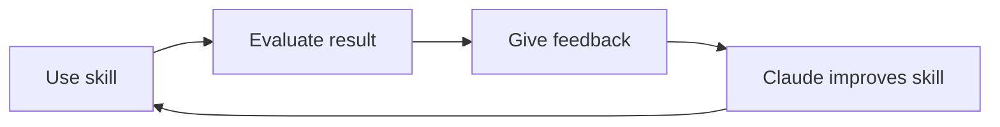

I've been seeing people giving nicknames to their AI assistant. I've taken to calling mine "Sancho" (Panza), a nod to that lovable character -- a practical, down-to-earth, loyal and skeptical fellow who avoids his own "hallucinations." Let's see if I can find time here and there to write notes about Agentic AI.

One of Sancho's key decisions is to rely on concrete abilities -- **Agent Skills**, an architecture designed for AI models to learn and execute specific procedures in a persistent manner.

<br clear="left"/>
<!--more-->

## The revolution

On December 18, 2025, Anthropic released Agent Skills as an **open standard** with a public specification and a reference SDK. Two months later, Google, Microsoft, OpenAI, Cursor, Figma, Notion... everyone had adopted it. By January 2026, Claude's Skills work in Gemini CLI, VS Code, GitHub Copilot, ChatGPT and any self-respecting "vibe coding" tool.

Why all the fuss? Because it solves a problem we all had: **every time you open a conversation with AI, you start from scratch**. You explain who you are, what you do, how you want things. You give it context, what the output format should be, what to avoid... and so on every time.

## What are Skills?

A Skill is a folder with instructions, scripts and resources that the AI loads **automatically** when they're relevant to a specific task. Think of them as **the recipe book** for a chef or the **onboarding manual** for a digital employee.

Instead of explaining to the AI every time how you want your reports, you give it a manual once, it saves it, and every time you ask for a report, it reads that specific manual.

```text
my-skill/
├── SKILL.md   ← The only required file
└── (optional: scripts, references, templates...)
```

- **Selective loading**: Only loaded when needed (token efficiency)
- **Scalability**: You can have dozens of Skills ready without overloading the context
- **Portability**: They work in Claude, ChatGPT, Gemini, VS Code, Cursor...
- **Shareable**: You distribute them as regular folders

### What are they for?

Things Skills can help you with:

- Package **proven sales strategies** so the AI applies them in campaigns
- Focus work on a **Feature** or **document it** in a software development project
- Let the AI **respond to customers or analyze metrics** using exactly your criteria and business logic
- Create texts and marketing tailored for **specific audiences**
- **Share** skills with your team so everyone benefits from your expertise
- **Automate creative processes**, freeing up time for innovation

### But... isn't this the same as custom instructions?

If you already use Claude on the web (claude.ai), you might wonder: "how is this different from custom instructions or projects?" They're three distinct levels of personalization that Claude offers:

| Concept                          | Where it's configured                | Scope                                           | Example                                        |
| -------------------------------- | ------------------------------------ | ----------------------------------------------- | ---------------------------------------------- |
| **Custom instructions**          | Claude.ai settings (web)             | Global, all conversations                       | "Always reply in Spanish"                      |
| **Projects**                     | Claude.ai -> Projects                | A workspace with accumulated context            | "This project is my Hugo blog"                 |
| **Skills**                       | `.claude/skills/` folder in your repo | Specific procedures that activate automatically | "When asked to create a post, follow these phases" |

- **Custom instructions**: An option in Claude.ai settings where you define global preferences (language, tone, format). Always active in all your conversations.

- **Projects**: Workspaces within Claude.ai where you upload documents the AI remembers between sessions. Useful for ongoing work with accumulated context.

- **Skills**: Files in your repository (`.claude/skills/`) with specific procedures that activate automatically when relevant. They work in Claude Code, VS Code, Cursor and other tools that support the standard.

The key difference is that skills **don't compete for context** until they're needed. You can have 50 skills and only the relevant one will be loaded for your request. Also, skills travel with your code: anyone who clones your repository has them available.

## Anatomy of a Skill

The recommendation is to start with a single required file inside a specific folder named after the skill: **`.claude/<my-skill>/SKILL.md`**

```yaml
---
name: my-skill
description: Specific description of what it does and when to activate.
---
# Instructions

Markdown content with the instructions...
```

The **YAML frontmatter** has two critical fields:

- **name**: Lowercase identifier with hyphens (max 64 characters)
- **description**: Explains **what the skill does** and **when it should activate**. This description is key for the AI to know when to use it.

**Write in English (but generate in your language)**: An important decision: **configuration files should be in English**, but the content they generate can be in any language.

| Component          | Language  | Reason                                    |
| ------------------ | --------- | ----------------------------------------- |
| `CLAUDE.md`        | English   | Claude processes it with greater precision |
| `SKILL.md`         | English   | Technical instructions, reusable          |
| Guidelines         | English   | Universal technical documentation         |
| Generated content  | Your language | Output can be Spanish, German, etc.    |

**Why English for configuration?**:

- Claude processes English instructions with greater precision
- It's easier to share skills with the community
- Technical terms are already in English (frontmatter, slug, draft...)
- You avoid awkward mixing ("El skill debe hacer el deploy del post")

**Why your language for output?**:

- It's natural: you write for your audience
- The skill specifies the output language in its instructions
- You can have reference files in your language (like `tone-reference.md` with examples in Spanish)

## The complete `.claude/` structure

Beyond the individual skill, there's a complete architecture that organizes all the knowledge the AI needs about your project. The structure lives in the `.claude/` directory:

```text
.claude/
├── CLAUDE.md                         # The project's brain
├── context/
│   ├── guideline_skills.md           # Guide for creating/reviewing skills
│   ├── guideline_python.md           # Python scripts (PEP 723)
│   └── guideline_js.md               # JavaScript/TypeScript scripts
└── skills/
    ├── fixing-markdown/              # Validates and formats markdown
    │   └── SKILL.md
    ├── removing-notebooklm/          # Removes watermarks from PDFs
    │   └── SKILL.md
    └── creating-apunte/              # Creates blog posts
        └── SKILL.md
```

**Why this structure?**

- **CLAUDE.md** is the only file that's always loaded. It defines the principles and points to other resources.
- **context/** contains context files (guidelines, conventions, references) that are **not loaded automatically**.
- **skills/** contains the skills, each in its own folder with its SKILL.md, which are also **not loaded automatically**.

This separation allows Claude to work with dozens of context files and skills without overloading the context window.

### The `context/` directory

The `.claude/context/` directory is your **reference library**. Here you store documentation that Claude might need, but that **shouldn't always be loaded**. The key is that these files are only read when CLAUDE.md indicates it.

In my blog I have several files under my [.claude/context](https://github.com/LuisPalacios/LuisPalacios.github.io/tree/gh-pages/.claude/context) directory:

| File | Content | When it's loaded |
| --- | --- | --- |
| `guideline_skills.md` | How to create and review skills | When working on a skill |
| `guideline_python.md` | PEP 723, uv run, zero-footprint | When creating Python scripts |
| `guideline_js.md` | pnpm dlx, tsx, CLI tools | When creating JavaScript scripts |
| `post-conventions.md` | Frontmatter, structure, naming | When creating or editing posts |
| `shortcodes.md` | Hugo shortcodes documentation | When using shortcodes |

**The critical part**: These files **don't load on their own**. It's CLAUDE.md that says when to read them. If you don't specify it in CLAUDE.md, Claude won't know they exist.

That's why in my [CLAUDE.md](https://github.com/LuisPalacios/LuisPalacios.github.io/blob/gh-pages/.claude/CLAUDE.md) I have sections like this:

```markdown
## Guidelines (Read Only When Needed)

| Guideline | When to Read |
| --- | --- |
| `.claude/context/guideline_skills.md` | Creating, reviewing, or updating a skill |
| `.claude/context/guideline_python.md` | Creating or modifying Python scripts |
| `.claude/context/guideline_js.md` | Creating or modifying JavaScript/TypeScript |
```

This tells Claude: "these files exist, but only read them when the task requires it." Result: massive token savings.

## CLAUDE.md: The most important file

The `CLAUDE.md` file is the project's **brain**. It's always loaded at the start of every conversation. That's why it should be concise and point to other resources instead of containing all the detail.

### Operating principles

It's not mandatory, but I always put it right at the beginning. I tell Sancho, "these are the principles that guide you":

```markdown
## Operating principles

- **Skills first**: Check if a skill exists before manual work
- **Self-improve**: When a skill fails, update its SKILL.md with the fix
- **Zero entropy**: Never create files outside defined structure
- **Minimal change**: Smallest coherent change that satisfies the request
```

Additionally, right after, pointing to the context files, I indicate which context files exist and when to read them. Add a table like this in your CLAUDE.md, adapting it to your files:

```markdown
## Guidelines (Read Only When Needed)

**IMPORTANT**: Only read these guidelines when actively working on skills or scripts. Do NOT read them for general documentation tasks.

| Guideline | When to Read |
| --- | --- |
| `.claude/context/guideline_skills.md` | Creating, reviewing, or updating a skill |
| `.claude/context/guideline_python.md` | Creating or modifying Python scripts (`.py` files) |
| `.claude/context/guideline_js.md` | Creating or modifying JavaScript/TypeScript (`.ts`, `.js`, `.mjs` files) |

## Context Files (Read Only When Needed)

| Context | When to Read |
| --- | --- |
| `.claude/context/post-conventions.md` | Creating/editing blog posts |
| `.claude/context/shortcodes.md` | Using Hugo shortcodes |
```

Without this reference in CLAUDE.md, it won't know those files exist.

## Progressive Loading

Skills are designed to load in layers as needed:

- Layer 1: The `name` and `description` metadata are always read on Claude startup. All metadata from all `SKILL.md` files are read. Each consumes ~100 tokens.
- Layer 2: Full `SKILL.md` content. Only read when the skill is activated.
- Layer 3: Additional files. Only read if needed.

The SKILL.md acts as an index pointing to additional reference files. It only loads what it needs:

```text
pdf-skill/
├── SKILL.md              # Main instructions
├── forms.md              # Forms guide (loads if relevant)
├── reference.md          # API reference (loads if needed)
└── scripts/
    └── validate.py       # Executed, not loaded into context
```

This architecture optimizes token usage: files don't consume context until they're read.

## Real example: my `creating-apunte` skill

Check the [gh-pages](https://github.com/LuisPalacios/LuisPalacios.github.io/tree/gh-pages/.claude/skills) branch of this very blog for the skills I use to create posts. For example, to create this very post, I started like this:

```text
/creating-apunte

Topic: Sancho aprende Skills

Sources:
- https://platform.claude.com/docs/en/agents-and-tools/agent-skills/best-practices
- https://aimafia.substack.com/p/skills-ia

Category: ia

Tags: ia, claude, aprendizaje, agentes

Post type: short

Logo: create it

Focus areas: El proyecto "Sancho" empieza hablando sobre los "Agent Skills", una arquitectura diseñada para que los modelos de inteligencia artificial aprendan y ejecuten procedimientos específicos de forma persistente

Contexto adicional:

Mis notas sueltas sobre el tema...

Empiezo una serie de apuntes técnicos sobre "Sancho", ... (here I put my entire draft written by me, a fairly long context).
:
```

The skill has this structure:

```text
creating-apunte/
├──  logo-creation.md     # SVG logo creation guide
├──  SKILL.md             # The skill itself, process phases
├──  template.md          # Hugo structure
├──  tone-reference.md    # Blog style patterns
└──  workflow.md          # Planning flow for creating the post
```

The `SKILL.md` file is the most important one -- it contains the phases: gather inputs -> research -> generate draft -> validate. The reference files contain the detail that the AI loads when needed.

## Iterate to improve

It didn't write the entire post for me, but rather a first draft. It's **crucial** to know that AI hallucinates -- by definition, it's probabilistic and will get things wrong. What's critical is iterating. The cycle is simple:



After using my skill, I "read and improved" what it had created. I can't stop seeing garbage in what gets published on the internet -- many people don't even read what the AI writes for them, and the blunders are hilarious.

My recommendation: Read, understand, review, write and iterate, and above all, commit to the result. Oh! And push your AI hard -- tell it what you DIDN'T like, what it did wrong, how to fix it, or better yet, fix it yourself and explain how you corrected it. For example, if I don't like the tone of what it creates, I tell it it's wrong, what I want, and ask it to update the skill's [`tone-reference`](https://github.com/LuisPalacios/LuisPalacios.github.io/blob/gh-pages/.claude/skills/creating-apunte/tone-reference.md) file:

| Aspect         | Key question                                                                                                                                        |
| -------------- | --------------------------------------------------------------------------------------------------------------------------------------------------- |
| **Tone**       | Doesn't sound like my other posts, I tell it > "`You messed up, <this> is wrong, I changed it to <this other>, update @tone-reference.md`"         |
| **Structure**  | Missing or extra sections? > `I missed having a logo-creation.md in the skill to help me create SVGs, create one and let's iterate`"               |
| **Workflow**   | Was the process smooth? Yes, not changing anything for now                                                                                          |

Specific feedback will make your results improve over time.

### Example: optimizing guideline_python.md

My Python guideline started at 2,400 tokens. In each iteration I told Claude:

```text
"You messed up here, this is wrong: you don't need to explain what a shebang is.
Remove everything Claude already knows. Update @guideline_python.md"
```

After five iterations: 300 tokens. **87% reduction**. The file now contains only what's specific to the workflow (PEP 723, uv run) and nothing that Claude already knows.

## Tips for creating Skills

### Be concise

The context window is a shared resource. Your Skill competes with the conversation history, other Skills and the current request.

Ask yourself about every paragraph:

- Does Claude really need this explanation?
- Can I assume Claude already knows this?
- Does this paragraph justify its token cost?

**Real example**: My Python guideline went from 2,400 tokens to 300 tokens. How? I removed explanations about import syntax (Claude knows it), what a shebang is (Claude knows it), how `if __name__ == '__main__'` works (Claude knows it). I left only what's specific: PEP 723, `uv run`, zero-footprint.

```text
# BEFORE (~150 tokens)
To execute Python scripts, you first need to create a
virtual environment with `python -m venv .venv`, activate it with
`source .venv/bin/activate`, install the dependencies...

# AFTER (~30 tokens)
Execute: `uv run script.py`
Dependencies: PEP 723 inline metadata
```

The rule is simple: **remove what Claude already knows, leave only what's unique to your workflow**.

### Write specific descriptions

The description determines when the Skill activates. Be specific:

```yaml
# Bad
description: Helps with documents

# Good
description: Extract text and tables from PDFs, fill forms.
             Use when user mentions PDFs, forms, or extraction.
```

**Real examples from my skills**:

```yaml
# fixing-markdown
description: Validate and fix markdown formatting in files and folders.
             Use when the user wants to check formatting, validate markdown,
             fix lint errors, revisar formato, validar notas.

# removing-notebooklm
description: Remove the NotebookLM watermark from PDFs and images.
             Use when the user wants to remove the NotebookLM watermark,
             eliminar el watermark, quitar la marca de agua.
```

Notice I include **triggers in both Spanish and English**. Claude detects the language and activates the skill when it matches.

Test with different models -- what works perfectly for Opus may need more detail for Haiku. If you plan to use the skill across multiple models, aim for instructions that work for all of them.

## Real examples in this project

This very blog has three skills you can check out as reference:

### fixing-markdown

A skill that combines **Python + JavaScript CLI tools** to validate and format markdown:

```text
fixing-markdown/
├── SKILL.md
├── .markdownlint-cli2.jsonc
├── .prettierrc
└── scripts/
    └── fix_md_extra.py
```

It orchestrates three tools in sequence:

1. `markdownlint-cli2` -- Fixes structure (headings, lists, spacing)
2. `fix_md_extra.py` -- Fixes what markdownlint can't (MD040, MD025)
3. `prettier` -- Formats tables and visual spacing

**Zero-footprint**: Uses `pnpm dlx` for JS tools and `uv run` for the Python script. No `node_modules` or `.venv` created in the repo.

### removing-notebooklm

A skill with **pure Python** that removes watermarks from PDFs and images:

```text
removing-notebooklm/
├── SKILL.md
└── scripts/
    └── removing-notebooklm.py
```

The script uses **PEP 723** to declare inline dependencies:

```python
# /// script
# requires-python = ">=3.11"
# dependencies = ["Pillow", "pymupdf", "opencv-python", "numpy"]
# ///
```

You run it with `uv run removing-notebooklm.py image.png` and the dependencies are automatically installed in the global cache.

### creating-apunte

My skill for creating posts (we already saw it above). It's the most complex, with multiple reference files for tone, structure and workflow.

**Check the code**: [.claude/skills on GitHub (gh-pages branch)](https://github.com/LuisPalacios/LuisPalacios.github.io/tree/gh-pages/.claude/skills)

## Plugins

Besides having your own Skills, another option is to use "Plugins" full of Skills. There are many out there on the internet. If you want to open that can of worms, take a look at an example. We've created a small project [Agentic AI Palas](https://github.com/Jacopalas/agentic-ai-palas) that makes it easy to get started, to break the ice.

## MCP vs Skills

Another topic: **MCP (Model Context Protocol)** is a protocol for AI to access external data: APIs, databases, services. Think of MCP as the **plumbing** that connects AI to your systems. To understand the difference:

| Aspect           | MCP                          | Skills                         |
| ---------------- | ---------------------------- | ------------------------------ |
| **Function**     | Access to external data      | Procedures and methodologies   |
| **Analogy**      | Plumbing / infrastructure    | Recipe book                    |
| **Example**      | Connect to BigQuery          | Analyze data with your criteria|
| **Persistence**  | Active connections           | Portable instructions          |

**When to use each one?**:

- **MCP**: When you need real-time data (current sales, server status, open tickets)
- **Skills**: When you need consistent, repeatable processes (generate reports, review code, create content)
- **Both**: When you need external data processed with your specific methodology

## References

### Downloadable templates

Here are some examples (click each one to see the content):









### Production examples

- **[Agentic AI Palas](https://github.com/Jacopalas/agentic-ai-palas)** -- Example project with ready-to-use skills
- **[This blog (gh-pages branch)](https://github.com/LuisPalacios/LuisPalacios.github.io/tree/gh-pages/.claude)** -- My real configuration with three working skills

### Claude.ai documentation

| Resource                                                                                                                | Description                                                                                                                                                                                                                                                                                               |
| ----------------------------------------------------------------------------------------------------------------------- | --------------------------------------------------------------------------------------------------------------------------------------------------------------------------------------------------------------------------------------------------------------------------------------------------------- |
| [Skills in Claude Code](https://code.claude.com/docs/en/skills)                                                         | Create, manage and share Skills to extend Claude's capabilities in Claude Code. Includes slash-type commands.                                                                                                                                                                                             |
| [Best practices for Agent Skills](https://platform.claude.com/docs/en/agents-and-tools/agent-skills/best-practices) | Learn to write effective Skills that Claude can discover and use successfully.                                                                                                                                                                                                                             |
| [Guide for creating Plugins](https://code.claude.com/docs/en/plugins)                                                   | How to create custom plugins to extend Claude Code through Skills, agents, hooks and MCP servers.                                                                                                                                                                                                         |
| [Claude Code Plugins](https://github.com/anthropics/claude-code/blob/main/plugins/README.md)                            | **GitHub** project. Contains some official Claude Code plugins that extend functionality through custom commands, agents and workflows. These are examples of what's possible with the Claude Code plugin system; many more plugins are available in community marketplaces.                               |

### Community contributions

| Resource                                                                      | Description                                                                                                                                                                                                                                                                                           |
| ---------------------------------------------------------------------------- | ----------------------------------------------------------------------------------------------------------------------------------------------------------------------------------------------------------------------------------------------------------------------------------------------------- |
| [Awesome-agent-skills](https://github.com/VoltAgent/awesome-agent-skills)    | Reliable, community-maintained collection of the best AI agent resources and Skills. Includes official Skills published by Anthropic, Google Labs, Vercel, Stripe, Cloudflare, Trail of Bits, Sentry, Expo, Hugging Face teams and more, along with community contributions.                          |
| [Everything Claude Code](https://github.com/affaan-m/everything-claude-code) | Comprehensive collection of Claude Code configurations by an Anthropic hackathon winner. Includes production agents, skills, hooks, commands, rules and MCP configurations evolved over more than 10 months of intensive daily use building real products.                                             |
| [Get Shit Done](https://github.com/glittercowboy/get-shit-done)              | A lightweight yet powerful system for meta-prompting, context engineering and spec-driven development for Claude, OpenCode and Gemini CLI, focused on productivity.                                                                                                                                    |
| [Claude Code Templates](https://github.com/davila7/claude-code-templates)    | Collection of AI agents, custom commands, configurations, hooks and integration examples with external systems (including MCP).                                                                                                                                                                        |
