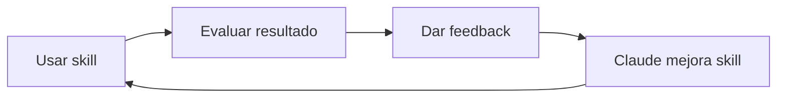

Estoy viendo por ahí que se suele poner un mote al asistente IA. Me ha dado por llamarlo "Sancho" (Panza), un guiño a este personaje tan simpático, un tipo práctico, con los pies en el suelo, leal y escéptico, que evita sus propias "alucinaciones". A ver si encuentro ratos aquí y allá para hacer apuntes sobre el tema de la IA Agéntica.

Uno de las decisiones de Sancho es basarse en habilidades concretas, los **Agent Skills**, una arquitectura diseñada para que los modelos de inteligencia artificial aprendan y ejecuten procedimientos específicos de manera persistente.

<br clear="left"/>
<!--more-->

## La revolución

El 18 de diciembre de 2025, Anthropic liberó los Agent Skills como un **estándar abierto** con una especificación pública y un SDK de referencia. Dos meses después, Google, Microsoft, OpenAI, Cursor, Figma, Notion... todo el mundo lo había adoptado. En enero de 2026, las Skills de Claude funcionan en Gemini CLI, VS Code, GitHub Copilot, ChatGPT y en otras herramientas de "vibe coding" que se precien.

¿Por qué tanto revuelo? Porque resuelve un problema que todos teníamos: **cada vez que abres una conversación con IA, empiezas de cero**. Le explicas quién eres, qué haces, cómo quieres las cosas. Le das contexto, cuál es el formato de salida, qué evitar... y así cada vez.

## ¿Qué son las Skills?

Una Skill (habilidad) es una carpeta con instrucciones, scripts y recursos que la IA carga **automáticamente** cuando son relevantes para una tarea concreta. Piensa que son como **el libro de recetas** para un chef o el **manual de onboarding** para un empleado digital.

En lugar de explicarle a la IA cada vez cómo quieres tus informes, le das un manual una sola vez, lo guarda, y cada vez que pides un informe, se lee ese manual en concreto.

```text
mi-skill/
├── SKILL.md   ← El único archivo obligatorio
└── (opcional: scripts, referencias, plantillas...)
```

- **Carga selectiva**: Solo se carga cuando se necesita (eficiencia de tokens)
- **Escalabilidad**: Puedes tener docenas de Skills listos sin sobrecargar el contexto
- **Portabilidad**: Funcionan en Claude, ChatGPT, Gemini, VS Code, Cursor...
- **Compartibles**: Los distribuyes como carpetas normales

### ¿Para qué sirven?

Cosas en las que te pueden ayudar las Skills:

- Empaquetar **estrategias de ventas** probadas para que la IA las aplique en campañas
- Trabajar con foco en una **Feature** o **documentarla** en un proyecto de desarrollo de software.
- Permitir que la IA **responda a clientes o analice métricas** usando exactamente tu criterio y lógica de negocio
- Crear textos y marketing adaptados para **audiencias específicas**
- **Compartir** skills con tu equipo para que todos aprovechen tu experiencia
- **Automatizar procesos** creativos, liberando tiempo para la innovación

### Pero... ¿no es lo mismo que las instrucciones personalizadas?

Si ya usas Claude en la web (claude.ai), quizá te preguntes: "¿y esto en qué se diferencia de las instrucciones personalizadas o de los proyectos?". Son tres niveles distintos de personalización que ofrece Claude:

| Concepto                         | Dónde se configura                   | Alcance                                         | Ejemplo                                        |
| -------------------------------- | ------------------------------------ | ----------------------------------------------- | ---------------------------------------------- |
| **Instrucciones personalizadas** | Ajustes de Claude.ai (web)           | Global, todas las conversaciones                | "Respóndeme siempre en español"                |
| **Proyectos**                    | Claude.ai → Proyectos                | Un espacio de trabajo con contexto acumulado    | "Este proyecto es mi blog Hugo"                |
| **Skills**                       | Carpeta `.claude/skills/` en tu repo | Procedimientos específicos que se activan solos | "Cuando pida crear un post, sigue estas fases" |

- **Instrucciones personalizadas**: Una opción en los ajustes de Claude.ai donde defines preferencias globales (idioma, tono, formato). Siempre están activas en todas tus conversaciones.

- **Proyectos**: Espacios de trabajo dentro de Claude.ai donde subes documentos que la IA recuerda entre sesiones. Útil para trabajo continuo con contexto acumulado.

- **Skills**: Archivos en tu repositorio (`.claude/skills/`) con procedimientos concretos que se activan automáticamente cuando son relevantes. Funcionan en Claude Code, VS Code, Cursor y otras herramientas que soporten el estándar.

La diferencia clave es que los skills **no compiten por contexto** hasta que se necesitan. Puedes tener 50 skills y solo se cargará el que sea relevante para tu petición. Además, los skills viajan con tu código: cualquiera que clone tu repositorio los tiene disponibles.

## Anatomía de un Skill

Se recomienda empezar con un único archivo obligatorio dentro de una carpeta específica con el nombre del skill: **`.claude/<my-skill>/SKILL.md`**

```yaml
---
name: my-skill
description: Specific description of what it does and when to activate.
---
# Instructions

Markdown content with the instructions...
```

El **frontmatter YAML** tiene dos campos críticos:

- **name**: Identificador en minúsculas con guiones (máx. 64 caracteres)
- **description**: Explica **qué hace** el skill y **cuándo debe activarse**. Esta descripción es clave para que la IA sepa cuándo usarlo.

**Escribe en inglés (pero genera en tu idioma)**: Una decisión importante: **los ficheros de configuración deben estar en inglés**, pero el contenido que generan puede estar en cualquier idioma.

| Componente         | Idioma    | Motivo                                    |
| ------------------ | --------- | ----------------------------------------- |
| `CLAUDE.md`        | Inglés    | Claude lo procesa con mayor precisión     |
| `SKILL.md`         | Inglés    | Instrucciones técnicas, reutilizables     |
| Guidelines         | Inglés    | Documentación técnica universal           |
| Contenido generado | Tu idioma | El output puede ser español, alemán, etc. |

**¿Por qué inglés para la configuración?**:

- Claude procesa instrucciones en inglés con mayor precisión
- Es más fácil compartir skills con la comunidad
- Los términos técnicos ya están en inglés (frontmatter, slug, draft...)
- Evitas mezclas incómodas ("El skill debe hacer el deploy del post")

**¿Por qué tu idioma para el output?**:

- Es lo natural: escribes para tu audiencia
- El skill especifica el idioma de salida en sus instrucciones
- Puedes tener ficheros de referencia en tu idioma (como `tone-reference.md` con ejemplos en español)

## La estructura `.claude/` completa

Más allá del skill individual, hay una arquitectura completa que organiza todo el conocimiento que la IA necesita sobre tu proyecto. La estructura vive en el directorio `.claude/`:

```text
.claude/
├── CLAUDE.md                         # The project's brain
├── context/
│   ├── guideline_skills.md           # Guide for creating/reviewing skills
│   ├── guideline_python.md           # Scripts Python (PEP 723)
│   └── guideline_js.md               # Scripts JavaScript/TypeScript
└── skills/
    ├── fixing-markdown/              # Validates and formats markdown
    │   └── SKILL.md
    ├── removing-notebooklm/          # Removes watermarks from PDFs
    │   └── SKILL.md
    └── creating-apunte/              # Creates blog posts
        └── SKILL.md
```

**¿Por qué esta estructura?**

- **CLAUDE.md** es el único archivo que se carga siempre. Define los principios y apunta a otros recursos.
- **context/** contiene ficheros de contexto (guidelines, convenciones, referencias) que **no se cargan automáticamente**.
- **skills/** contiene los skills, cada uno en su carpeta con su SKILL.md, que **tampoco se cargan automáticamente**.

Esta separación permite que Claude trabaje con docenas de ficheros de contexto y skills sin sobrecargar la ventana de contexto.

### El directorio `context/`

El directorio `.claude/context/` es tu **biblioteca de referencia**. Aquí guardas documentación que Claude puede necesitar, pero que **no debe cargar siempre**. La clave es que estos ficheros solo se leen cuando CLAUDE.md lo indica.

En mi blog tengo varios ficheros bajo mi directorio [.claude/context](https://github.com/LuisPalacios/LuisPalacios.github.io/tree/gh-pages/.claude/context):

| Fichero | Contenido | Cuándo se carga |
| --- | --- | --- |
| `guideline_skills.md` | Cómo crear y revisar skills | Cuando trabajo en un skill |
| `guideline_python.md` | PEP 723, uv run, zero-footprint | Cuando creo scripts Python |
| `guideline_js.md` | pnpm dlx, tsx, CLI tools | Cuando creo scripts JavaScript |
| `post-conventions.md` | Frontmatter, estructura, naming | Cuando creo o edito posts |
| `shortcodes.md` | Documentación de shortcodes Hugo | Cuando uso shortcodes |

**Lo crítico**: Estos ficheros **no se cargan solos**. Es CLAUDE.md quien dice cuándo leerlos. Si no lo especificas en CLAUDE.md, Claude no sabrá que existen.

Por eso en mi [CLAUDE.md](https://github.com/LuisPalacios/LuisPalacios.github.io/blob/gh-pages/.claude/CLAUDE.md) tengo por ejemplo secciones como ésta:

```markdown
## Guidelines (Read Only When Needed)

| Guideline | When to Read |
| --- | --- |
| `.claude/context/guideline_skills.md` | Creating, reviewing, or updating a skill |
| `.claude/context/guideline_python.md` | Creating or modifying Python scripts |
| `.claude/context/guideline_js.md` | Creating or modifying JavaScript/TypeScript |
```

Esto le dice a Claude: "estos ficheros existen, pero solo léelos cuando la tarea lo requiera". Resultado: ahorro masivo de tokens.

## CLAUDE.md: El archivo más importante

El fichero `CLAUDE.md` es el **cerebro** del proyecto. Se carga siempre al inicio de cada conversación. Por eso debe ser conciso y apuntar a otros recursos en lugar de contener todo el detalle.

### Principios operativos

No es obligatorio, pero lo pongo siempre muy al principio. Le digo a Sando, "estos son los principios que te guían":

```markdown
## Operating principles

- **Skills first**: Check if a skill exists before manual work
- **Self-improve**: When a skill fails, update its SKILL.md with the fix
- **Zero entropy**: Never create files outside defined structure
- **Minimal change**: Smallest coherent change that satisfies the request
```

Además, justo detrás, apuntando a los ficheros de contexto, le indico qué ficheros de contexto existen y cuándo leerlos. Añade una tabla como esta en tu CLAUDE.md, adaptándola a tus ficheros:

```markdown
## Guidelines (Read Only When Needed)

**IMPORTANT**: Only read these guidelines when actively working on skills or scripts. Do NOT read them for general documentation tasks.

| Guideline | When to Read |
| --- | --- |
| `.claude/context/guideline_skills.md` | Creating, reviewing, or updating a skill |
| `.claude/context/guideline_python.md` | Creating or modifying Python scripts (`.py` files) |
| `.claude/context/guideline_js.md` | Creating or modifying JavaScript/TypeScript (`.ts`, `.js`, `.mjs` files) |

## Context Files (Read Only When Needed)

| Context | When to Read |
| --- | --- |
| `.claude/context/post-conventions.md` | Creating/editing blog posts |
| `.claude/context/shortcodes.md` | Using Hugo shortcodes |
```

Sin esta referencia en CLAUDE.md, no sabrá que esos ficheros existen.

## Carga Progresiva

Los skills están diseñados para que se carguen por capas según sea necesario:

- Capa 1: Los Metadatos `name` y `description` se leen siempre, al arrancar Claude. Se leen todos los metadatos de todos los `SKILL.md`. Cada uno consume ~100 tokens.
- Capa 2: Contenido completo del `SKILL.md`. Se lee solo cuando el skill se activa.
- Capa 3: Archivos adicionales. Se leen solo si son necesarios.

El SKILL.md es como un índice que apunta a archivos de referencia adicionales. Solo carga lo que necesita:

```text
pdf-skill/
├── SKILL.md              # Main instructions
├── forms.md              # Forms guide (loads if relevant)
├── reference.md          # API reference (loads if needed)
└── scripts/
    └── validate.py       # Executed, not loaded into context
```

Esta arquitectura optimiza el uso de tokens: los archivos no consumen contexto hasta que se leen.

## Ejemplo real: mi skill `creating-apunte`

Consulta la rama [gh-pages](https://github.com/LuisPalacios/LuisPalacios.github.io/tree/gh-pages/.claude/skills) de este mismo blog las skills que utilizo crear apuntes. Por ejemplo, para crear este mismo apunte, empecé así:

```text
/creating-apunte

Topic: Sancho aprende Skills

Sources:
- https://platform.claude.com/docs/en/agents-and-tools/agent-skills/best-practices
- https://aimafia.substack.com/p/skills-ia

Category: ia

Tags: ia, claude, aprendizaje, agentes

Post type: short

Logo: create it

Focus areas: El proyecto "Sancho" empieza hablando sobre los "Agent Skills", una arquitectura diseñada para que los modelos de inteligencia artificial aprendan y ejecuten procedimientos específicos de forma persistente

Contexto adicional:

Mis notas sueltas sobre el tema...

Empiezo una serie de apuntes técnicos sobre "Sancho", ... (aqui metí todo mi borrador escrito por mí, un contexto bastante largo).
:
```

El skill tiene esta estructura:

```text
creating-apunte/
├──  logo-creation.md     # SVG logo creation guide
├──  SKILL.md             # The skill itself, process phases
├──  template.md          # Hugo structure
├──  tone-reference.md    # Blog style patterns
└──  workflow.md          # Planning flow for creating the post
```

El fichero `SKILL.md` es el más importante, contiene las fases: recopilar inputs → investigar → generar borrador → validar. Los archivos de referencia contienen el detalle que la IA carga cuando lo necesita.

## Iterar para mejorar

No me hizo el apunte entero, sino un primer borrador. Es **importantísimo** saber que la IA alucina, por definición, es probabilística y lo hará regular. Lo que es crítico es iterar, el ciclo es simple:



Después de usar mi skill, "leí y mejoré" lo que había creado. No paro de ver porquería en lo que se publica en internet, mucha gente ni si quiera se lee lo que le escriben y te partes que las meteduras de pata.

Mi recomendación: Lee, entiende, repasa, escribe e itera y sobre todo, comprométete con el resultado. Ah! y dale caña a tu IA, dile lo que NO te ha gustado, qué ha hecho mal, cómo corregirlo, o mejor todavía, corrígelo tú y explícale cómo lo has corregido. Por ejemplo, si el tono de lo que crea no me gusta, le digo que está mal y qué quiero y le pido que actualice el fichero [`tone-reference`](https://github.com/LuisPalacios/LuisPalacios.github.io/blob/gh-pages/.claude/skills/creating-apunte/tone-reference.md) del Skill:

| Aspecto        | Pregunta clave                                                                                                                                        |
| -------------- | ----------------------------------------------------------------------------------------------------------------------------------------------------- |
| **Tono**       | No suena como mis otros apuntes, se lo digo > "`Has patinado, <esto> está mal, lo he cambiado por <esto otro>, actualiza @tone-reference.md`                         |
| **Estructura** | ¿Faltan o sobran secciones? > `He echado en falta tener un logo-creation.md en el skill para que me ayudes a crear SVG's, crea uno y vamos iterando`" |
| **Workflow**   | ¿El proceso fue fluido? Sí, de momento no cambio nada                                                                                                 |

El feedback específico hará que tus resultados mejoren con el tiempo.

### Ejemplo: optimizando guideline_python.md

Mi guideline de Python empezó con 2,400 tokens. En cada iteración le decía a Claude:

```text
"Has patinado aquí, esto está mal: no necesitas explicar qué es un shebang.
Elimina todo lo que Claude ya sabe. Actualiza @guideline_python.md"
```

Tras cinco iteraciones: 300 tokens. **Reducción del 87%**. El fichero ahora tiene solo lo específico del workflow (PEP 723, uv run) y nada de lo que Claude ya conoce.

## Consejos para crear Skills

### Sé conciso

La ventana de contexto es un recurso compartido. Tu Skill compite con el historial de conversación, otras Skills y la petición actual.

Pregúntate en cada párrafo:

- ¿Claude realmente necesita esta explicación?
- ¿Puedo asumir que Claude ya sabe esto?
- ¿Este párrafo justifica su coste en tokens?

**Ejemplo real**: Mi guideline de Python pasó de 2,400 tokens a 300 tokens. ¿Cómo? Eliminé explicaciones sobre sintaxis de imports (Claude lo sabe), qué es un shebang (Claude lo sabe), cómo funciona `if __name__ == '__main__'` (Claude lo sabe). Dejé solo lo específico: PEP 723, `uv run`, zero-footprint.

```text
# ANTES (~150 tokens)
Para ejecutar scripts Python, primero necesitas crear un
entorno virtual con `python -m venv .venv`, activarlo con
`source .venv/bin/activate`, instalar las dependencias...

# DESPUÉS (~30 tokens)
Execute: `uv run script.py`
Dependencies: PEP 723 inline metadata
```

La regla es simple: **elimina lo que Claude ya sabe, deja solo lo único de tu workflow**.

### Escribe descripciones específicas

La descripción determina cuándo se activa el Skill. Sé específico:

```yaml
# Bad
description: Helps with documents

# Good
description: Extract text and tables from PDFs, fill forms.
             Use when user mentions PDFs, forms, or extraction.
```

**Ejemplos reales de mis skills**:

```yaml
# fixing-markdown
description: Validate and fix markdown formatting in files and folders.
             Use when the user wants to check formatting, validate markdown,
             fix lint errors, revisar formato, validar notas.

# removing-notebooklm
description: Remove the NotebookLM watermark from PDFs and images.
             Use when the user wants to remove the NotebookLM watermark,
             eliminar el watermark, quitar la marca de agua.
```

Fíjate que incluyo **triggers en español e inglés**. Claude detecta el idioma y activa el skill cuando coincide.

Prueba con diferentes modelos, lo que funciona perfecto para Opus puede necesitar más detalle para Haiku. Si planeas usar el skill en varios modelos, busca instrucciones que funcionen para todos.

## Ejemplos reales en este proyecto

Este mismo blog tiene tres skills que puedes consultar como referencia:

### fixing-markdown

Un skill que combina **Python + JavaScript CLI tools** para validar y formatear markdown:

```text
fixing-markdown/
├── SKILL.md
├── .markdownlint-cli2.jsonc
├── .prettierrc
└── scripts/
    └── fix_md_extra.py
```

Orquesta tres herramientas en secuencia:

1. `markdownlint-cli2` — Corrige estructura (headings, listas, espacios)
2. `fix_md_extra.py` — Arregla lo que markdownlint no puede (MD040, MD025)
3. `prettier` — Formatea tablas y espaciado visual

**Zero-footprint**: Usa `pnpm dlx` para las herramientas JS y `uv run` para el script Python. No crea `node_modules` ni `.venv` en el repo.

### removing-notebooklm

Un skill con **Python puro** que elimina watermarks de PDFs e imágenes:

```text
removing-notebooklm/
├── SKILL.md
└── scripts/
    └── removing-notebooklm.py
```

El script usa **PEP 723** para declarar dependencias inline:

```python
# /// script
# requires-python = ">=3.11"
# dependencies = ["Pillow", "pymupdf", "opencv-python", "numpy"]
# ///
```

Ejecutas con `uv run removing-notebooklm.py imagen.png` y las dependencias se instalan automáticamente en caché global.

### creating-apunte

Mi skill para crear posts (ya lo vimos antes). Es el más complejo, con múltiples archivos de referencia para tono, estructura y workflow.

**Consulta el código**: [.claude/skills en GitHub (rama gh-pages)](https://github.com/LuisPalacios/LuisPalacios.github.io/tree/gh-pages/.claude/skills)

## Plugins

Además de tener tus propios Skills, otra opción es que uses "Plugins" llenos de Skills. Hay muchos por ahí por internet. Si quieres abrir ese melón, échale un ojo a un ejemplo. Hemos creado un pequeño proyecto [Agentic AI Palas](https://github.com/Jacopalas/agentic-ai-palas) que te facilita empezar de manera sencilla, para romper el hielo.

## MCP vs Skills

Otro tema más: **MCP (Model Context Protocol)**, es un protocolo para que la IA acceda a datos externos: APIs, bases de datos, servicios. Piensa en MCP como la **fontanería** que conecta la IA con tus sistemas. Por entender la diferencia:

| Aspecto          | MCP                          | Skills                         |
| ---------------- | ---------------------------- | ------------------------------ |
| **Función**      | Acceso a datos externos      | Procedimientos y metodologías  |
| **Analogía**     | Fontanería / infraestructura | Libro de recetas               |
| **Ejemplo**      | Conectar con BigQuery        | Analizar datos con tu criterio |
| **Persistencia** | Conexiones activas           | Instrucciones portables        |

**¿Cuándo usar cada uno?**:

- **MCP**: Cuando necesitas datos en tiempo real (ventas actuales, estado de servidores, tickets abiertos)
- **Skills**: Cuando necesitas procesos consistentes y repetibles (generar informes, revisar código, crear contenido)
- **Ambos**: Cuando necesitas datos externos procesados con tu metodología específica

## Referencias

### Plantillas descargables

Dejo aquí algunos ejemplos (haz clic en cada uno para ver el contenido):









### Ejemplos en producción

- **[Agentic AI Palas](https://github.com/Jacopalas/agentic-ai-palas)** — Proyecto de ejemplo con skills listos
- **[Este blog (rama gh-pages)](https://github.com/LuisPalacios/LuisPalacios.github.io/tree/gh-pages/.claude)** — Mi configuración real con tres skills funcionando

### Documentación Claude.ai

| Recurso                                                                                                                 | Descripción                                                                                                                                                                                                                                                                                                               |
| ----------------------------------------------------------------------------------------------------------------------- | ------------------------------------------------------------------------------------------------------------------------------------------------------------------------------------------------------------------------------------------------------------------------------------------------------------------------- |
| [Skills en Claude Code](https://code.claude.com/docs/en/skills)                                                         | Crea, gestiona y comparte Skills para ampliar las capacidades de Claude en Claude Code. Incluye comandos tipo “slash”.                                                                                                                                                                                                    |
| [Mejores prácticas para Agent Skills](https://platform.claude.com/docs/en/agents-and-tools/agent-skills/best-practices) | Aprende a redactar Skills efectivas que Claude pueda descubrir y utilizar con éxito.                                                                                                                                                                                                                                      |
| [Guía para crear Plugins](https://code.claude.com/docs/en/plugins)                                                      | Cómo crear plugins personalizados para extender Claude Code mediante Skills, agentes, hooks y servidores MCP.                                                                                                                                                                                                             |
| [Claude Code Plugins](https://github.com/anthropics/claude-code/blob/main/plugins/README.md)                            | Proyecto en **GitHub**. Contiene algunos plugins oficiales de Claude Code que amplían la funcionalidad mediante comandos personalizados, agentes y flujos de trabajo. Son ejemplos de lo que es posible con el sistema de plugins de Claude Code; hay muchos más plugins disponibles en los marketplaces de la comunidad. |

### Contribuciones de la comunidad

| Recurso                                                                      | Descripción                                                                                                                                                                                                                                                                                           |
| ---------------------------------------------------------------------------- | ----------------------------------------------------------------------------------------------------------------------------------------------------------------------------------------------------------------------------------------------------------------------------------------------------- |
| [Awesome-agent-skills](https://github.com/VoltAgent/awesome-agent-skills)    | Colección fiable y mantenida por la comunidad de los mejores recursos y Skills para agentes IA. Incluye Skills oficiales publicados por equipos de Anthropic, Google Labs, Vercel, Stripe, Cloudflare, Trail of Bits, Sentry, Expo, Hugging Face y más, junto a aportes de la comunidad.              |
| [Everything Claude Code](https://github.com/affaan-m/everything-claude-code) | Colección completa de configuraciones para Claude Code realizada por un ganador de hackathon de Anthropic. Incluye agentes en producción, skills, hooks, comandos, reglas y configuraciones de MCP evolucionadas a lo largo de más de 10 meses de uso intensivo diario construyendo productos reales. |
| [Get Shit Done](https://github.com/glittercowboy/get-shit-done)              | Un sistema ligero y potente de meta-prompting, ingeniería de contexto y desarrollo guiado por especificaciones para Claude, OpenCode y Gemini CLI, enfocado en la productividad.                                                                                                                      |
| [Claude Code Templates](https://github.com/davila7/claude-code-templates)    | Colección de agentes de IA, comandos personalizados, configuraciones, hooks y ejemplos de integración con sistemas externos (incluye MCP).                                                                                                                                                            |
