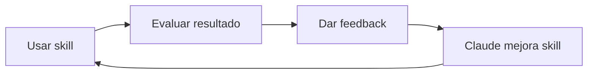

# Cómo usar los Skills de Claude Code

Esta guía explica cómo utilizar los skills disponibles en este repositorio y cómo mejorarlos mediante feedback.

## Qué son los Skills

Los skills son instrucciones estructuradas que Claude Code utiliza para realizar tareas específicas. Están definidos en `.claude/skills/` con un archivo `SKILL.md` que contiene metadata y las instrucciones.

Claude carga automáticamente la metadata de los skills al iniciar y los activa cuando detecta que tu petición coincide con la descripción del skill.

## Skills Disponibles

| Skill | Ejemplo de uso |
| --- | --- |
| `creating-apunte` | "Créame un apunte sobre Tailscale" |
| `fixing-markdown` | "Corrige el formato del post sobre pdfly" |
| `removing-notebooklm` | "Quita la marca de agua de este PDF" |

**Más ejemplos de frases que activan cada skill:**

- **creating-apunte**: "Escríbeme un post para el blog", "Quiero documentar cómo configuré X", "Nueva entrada sobre Docker"
- **fixing-markdown**: "Revisa el markdown de mis notas", "Valida el formato de los posts", "Arregla el formato de este fichero"
- **removing-notebooklm**: "Elimina el watermark de NotebookLM", "Limpia esta imagen de la marca"

## Invocación Avanzada

Para control explícito, usa la sintaxis `/skill-name [argumentos]`.

### Ejemplo: Crear un nuevo apunte

```text
/creating-apunte

Topic: Configuración de Tailscale en un homelab

Sources:
- https://tailscale.com/kb/1017/install
- My setup: Proxmox host + 3 LXC containers, all connected via Tailscale

Category: infraestructura

Tags: tailscale, vpn, proxmox, lxc, networking

Post type: short

Logo: skip for now

Focus areas: Installation on Proxmox, subnet routing, exit nodes

Contexto adicional:
Mis notas sueltas sobre el tema...
- Instalé Tailscale en el host Proxmox primero
- Luego en cada container LXC
- El truco está en habilitar subnet routing para que los containers
  se vean entre ellos sin instalar Tailscale en cada uno
- Exit node lo configuré en el host principal
```

### Campos disponibles

| Campo | Obligatorio | Descripción |
| --- | --- | --- |
| Topic | Sí | Título o tema del post |
| Sources | Sí | URLs, documentos o texto de referencia |
| Category | Sí | `administración`, `desarrollo`, `herramientas`, `infraestructura`, `productividad`, `software` |
| Tags | No | Si no se dan, se generan del contenido |
| Post type | No | `short` (default), `long`, o `cheatsheet` |
| Logo | No | Path a SVG, "create one", o "skip for now" |
| Focus areas | No | Secciones a enfatizar |
| Contexto adicional | No | Notas, borradores, texto extenso a incorporar |

### Ejemplo: Corregir formato markdown

```text
/fixing-markdown src/content/posts/2025-11-30-navaja-pdfly.md
```

Para una carpeta completa:

```text
/fixing-markdown src/content/posts
```

## Iteración y Mejora

Los skills mejoran con el uso. El ciclo es simple:



Cada iteración refina el tono, corrige edge cases y clarifica instrucciones ambiguas.

## Feedback

Después de usar un skill, evalúa estos aspectos:

| Aspecto | Pregunta clave |
| --- | --- |
| **Tono** | ¿Suena como mis otros posts? |
| **Estructura** | ¿Faltan o sobran secciones? |
| **Workflow** | ¿El proceso fue útil o molesto? |
| **Output** | ¿Qué necesitó corrección manual? |

### Ejemplo de sesión

```text
Usuario: Créame un apunte sobre WireGuard

Claude: [Genera el post]

Usuario: Feedback:
1. Tono: Usa "procedemos a", prefiero "vamos a"
2. Estructura: Perfecto
3. Workflow: El outline fue útil
4. Output: Faltó <br clear="left"/> antes del <!--more-->

Claude: [Actualiza el skill con las mejoras]
```

## Estructura de un Skill

```text
nombre-skill/
├── SKILL.md           # Instrucciones principales (< 300 líneas)
├── tone-reference.md  # Patrones de estilo (opcional)
├── workflow.md        # Proceso detallado (opcional)
└── template.md        # Plantillas (opcional)
```

Ah!, sobre los Skills también se puede iterar, por ejemplo:

```text
- Please verify the creating-apunte SKILL and double check if Claude really need each explanation and that  each paragraph justify its token cost.
- Please verify if you would improve the SKILL somehow.
```

## Buenas Prácticas

- **Al usar**: Proporciona contexto suficiente, sé específico
- **Al dar feedback**: Cita el texto exacto, explica qué esperabas
- **Al mejorar**: Mantén SKILL.md bajo 300 líneas, documenta edge cases
